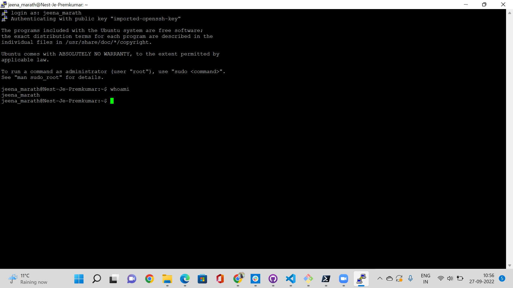

# Linux Setup
Linux machine is a virtual machine which is accessed using the SSH connection. The key and authetication details were given and we accessed the VM using the putty client as well as through the power shell.
## Key Terminologies
* SSH key which was a pem file which had to converted to pk file  while using the putty.
* Power shell was installed and was used to access teh VM using the Open SSH.

## Exercise
- Make an SSH-connection to your machine. SSH requires the key file to have specific permissions, so you might need to change those.
- When the connection is successful, type whoami in the terminal. This command should show your username.

### Sources

* [Open SSH](https://learn.microsoft.com/en-us/windows-server/administration/openssh/openssh_install_firstuse?tabs=powershell)

### Overcome challenges
 Initally used the pem file as the key in putty and it wasnt authenicating to open the SSH.Converted the key to ppk and it worked.
 Later on was able to make the connection to the VM using the power shell with the pem file itself.

 ### Results
 

