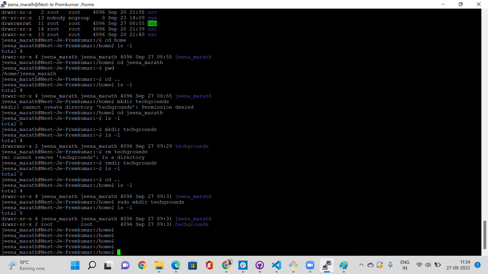
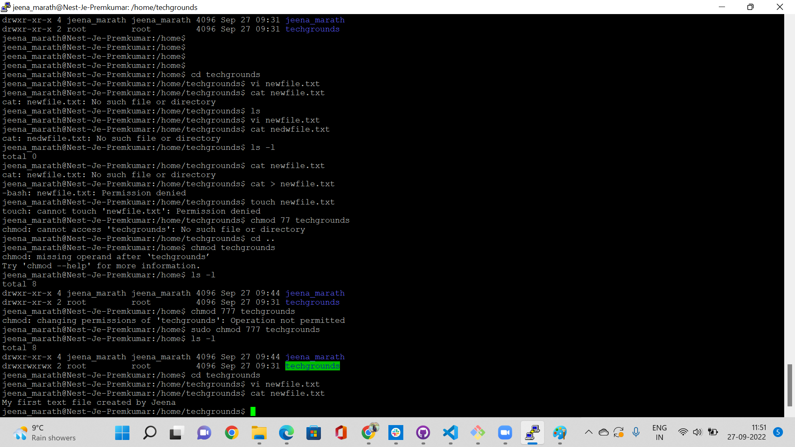
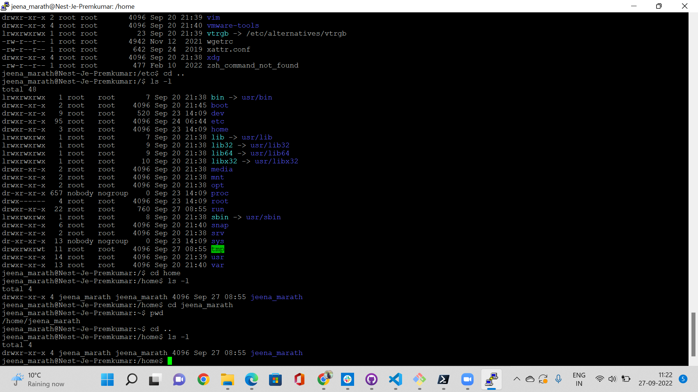
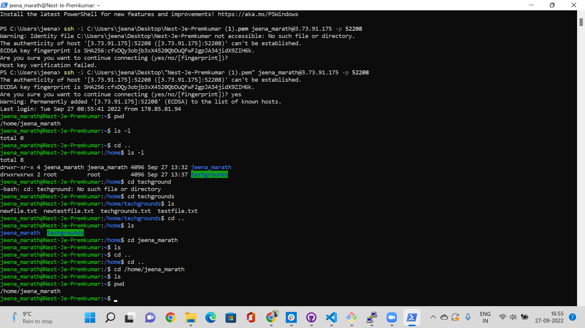

# Linux Files and Directories
Navigating through the Linux machine and creating directories and files.
## Key Terminologies
* pwd -gives the current working directory
* cd - change the directory or move to a directory
* sudo - gives the user the super user privilege
* ls - list the file/directories
* mkdir - make directory
* chmod - to change or modify permissions
* vi - to create a file and enter details
* cat- to display the contents of file
* Absolute path- The whole path need to given for the file.
* Relative path -The path relative to the current working directory

## Exercise
- Find out your current working directory.
- Make a listing of all files and directories in your home directory. You should see directories like ‘Desktop’, ‘Public’ and ‘Pictures’ among others.
- Within your home directory, create a new directory named ‘techgrounds’.
- Within the techgrounds directory, create a file containing some text.
- Move around your directory tree using both absolute and relative paths.

### Sources

* [Linux Commands](https://www.javatpoint.com/linux-directories)

### Overcome challenges
 The sudo in the command was not used intially and later on understood it has to be used when you need permissions to do some operations.
 

 ### Results
 Current working directory

 

 Directory structure

New file

List of files

Relative and absolute path

