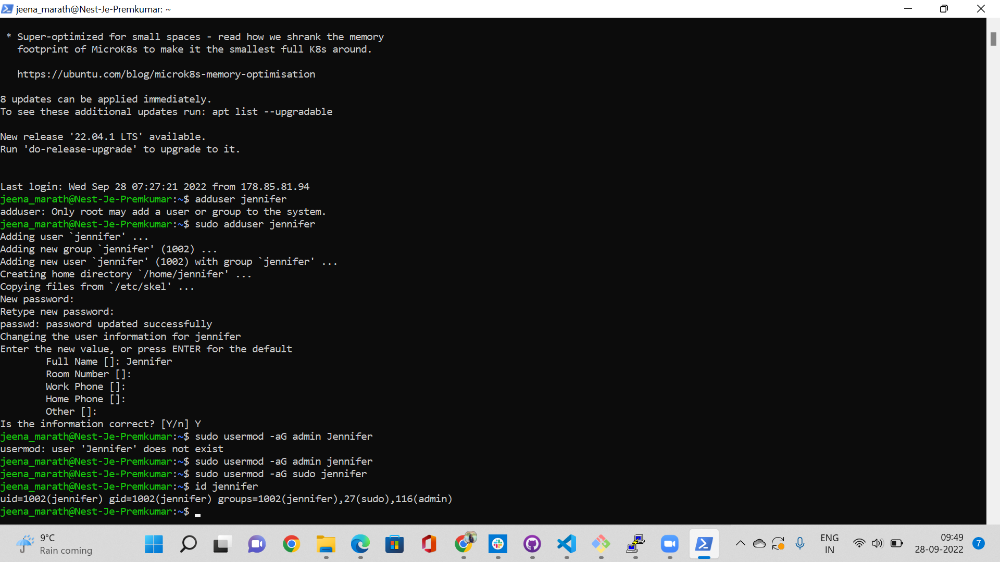
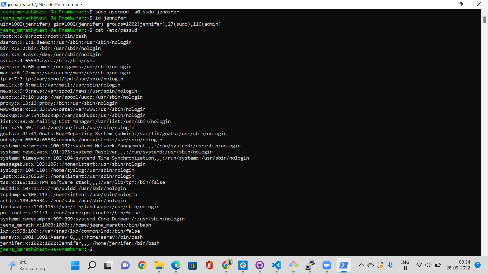

# Users and groups
Creating a new user , assigning to user to different groups and giving sudo access.
## Key Terminologies
* adduser - used to add a new user
* usermod -aG - used to give group access to particular groups.
* id username- it will give the details of that user.
* /etc/passwd  - Display all the user details,groups,password etc

## Exercise
- Create a new user in your VM. 
  - The new user should be part of an admin group.
  - The new user should have a password.
  - The new user should be able to use ‘sudo’
- Locate the files that store users, passwords, and groups. See if you can find your newly created user’s data in there.

### Sources

* [New user](https://linuxize.com/post/how-to-add-user-to-group-in-linux/)
* [Adding user](https://www.techrepublic.com/article/how-to-create-a-new-user-with-admin-privileges-on-linux/)
* [Adding user](https://www.cyberciti.biz/faq/add-new-user-account-with-admin-access-on-linux/)
* [Display user](https://linuxhint.com/where_and_how_are_passwords_stored_on_linux/)

### Overcome challenges
 No challenges faced.

 ### Results

 New User added

 

Display the user details

