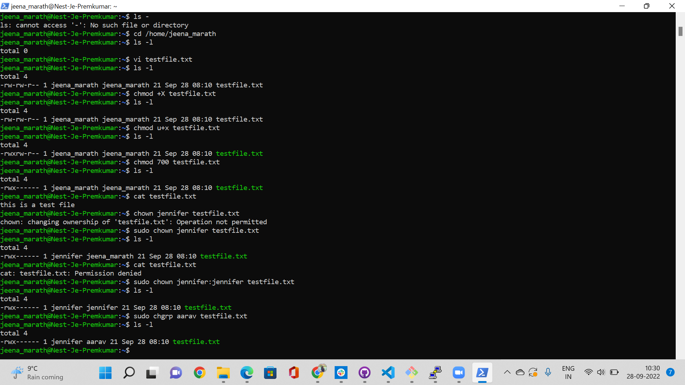

# File permissions
Permissions for file can be set by the user.The permissions of a file can be changed and modified for owner,group and others.
## Key Terminologies
* chmod - allows you to change the permissions on a file.
* chown - to change the ownership of a file/directory.
* chgrp - to change the group of a file/directory.

## Exercise
- Create a text file.
- Make a long listing to view the file’s permissions. Who is the file’s owner and group? What kind of permissions does the file have?
- Make the file executable by adding the execute permission (x).
- Remove the read and write permissions (rw) from the file for the group and everyone else, but not for the owner. Can you still read it?
- Change the owner of the file to a different user. If everything went well, you shouldn’t be able to read the file unless you assume root privileges with ‘sudo’.
- Change the group ownership of the file to a different group.

### Sources

* [File permission ](https://www.guru99.com/file-permissions.html)
* [File permission ](https://linuxize.com/post/chmod-command-in-linux/)
* [Add Users to groups](https://linuxize.com/post/how-to-add-user-to-group-in-linux/)
* [Executable file](https://linuxhandbook.com/make-file-executable/)
* [Changing ownership](https://www.hostingadvice.com/how-to/change-file-ownershipgroups-linux/)

### Overcome challenges
 No challenges faced. 

 ### Results

File permissions and ownerships

 

