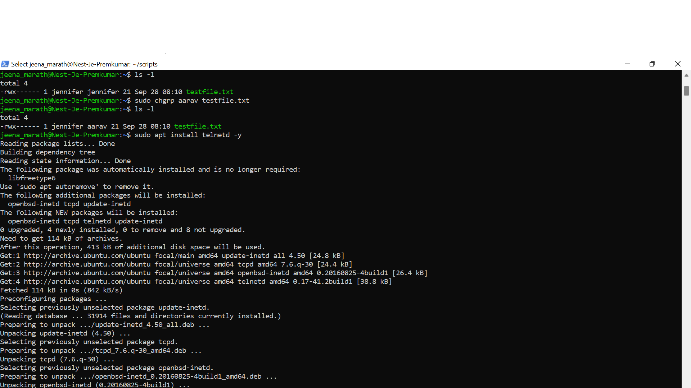
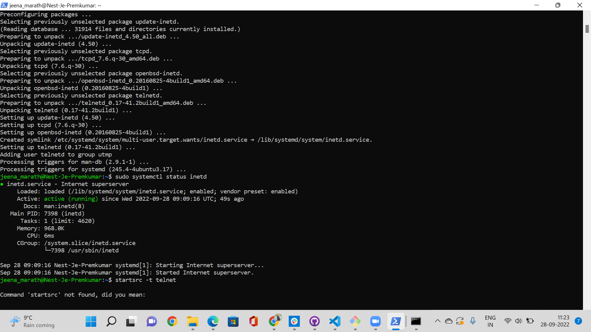
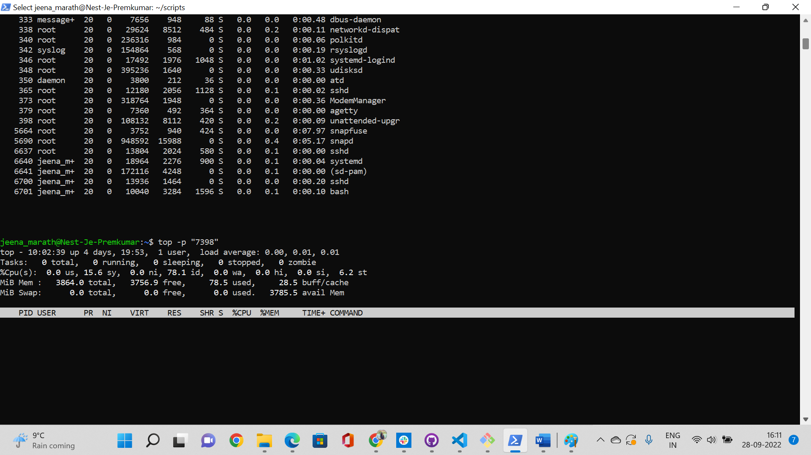

# Processes
Processes in Linux can be divided into three categories: Daemons, Services, and Programs.
A daemon runs in the background and is non-interactive. A Service responds to requests from programs. A service may be interactive. A program is run and used by users (e.g. Vim).

## Key Terminologies

- apt-install - is a command used to install packages.
- kill - is used to termincate a process.
- top - a command used to show active processes and other system information.

## Exercise
- Start the telnet daemon.
- Find out the PID of the telnet daemon.
- Find out how much memory telnetd is using.
- Stop or kill the telnetd process.

### Sources

* [Kill Process ](https://www.linuxfoundation.org/blog/blog/classic-sysadmin-how-to-kill-a-process-from-the-command-line)
* [Telnet ](https://www.digitalocean.com/community/tutorials/telnet-command-linux-unix)
* [Telnet Commands](https://phoenixnap.com/kb/top-command-in-linux#:~:text=To%20run%20the%20top%20command,view%20using%20the%20available%20options.&text=The%20switch%20(%20%2D%20)%20and%20whitespace%20characters%20are%20optional.)
* [Install Telnet](https://www.howtoforge.com/how-to-install-and-use-telnet-on-ubuntu//)

### Overcome challenges
My initial approach to do the assigment was to use the telnet open client in windows which was later clarified by peer as the requirment is to be done on the Linux machine. So started searching for resources related to telnet and ubuntu. This helped to get the results.

 ### Results

 The telnet daemon is installed before we can use it.

 

 The status of the telnet will give the PID and the memory used.

To terminate the process

Top command to check the process has stopped

