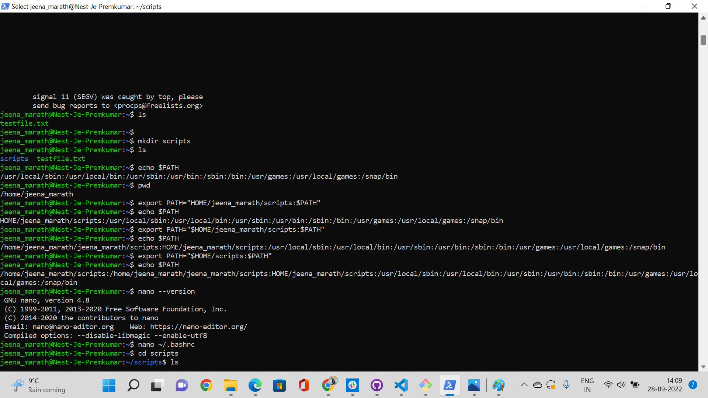
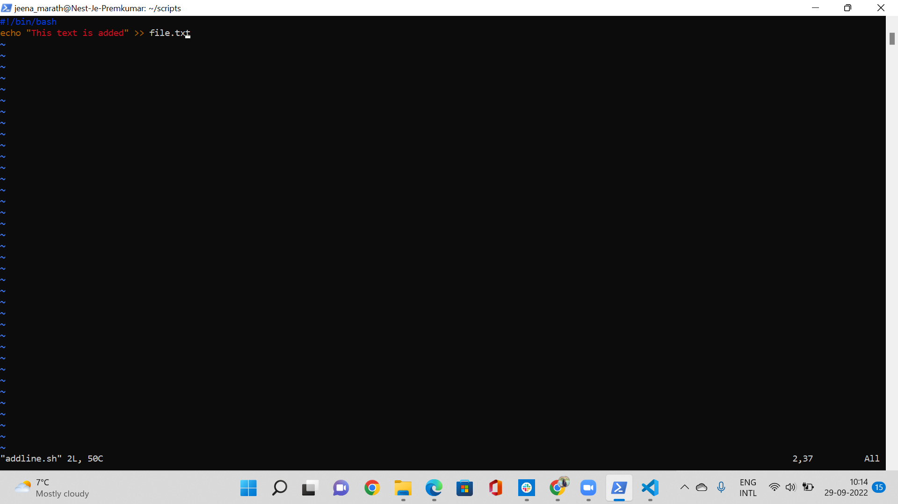
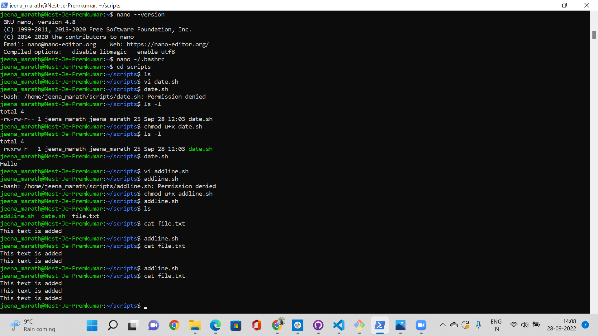
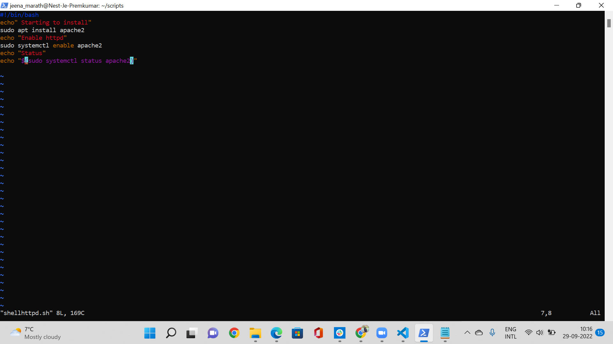
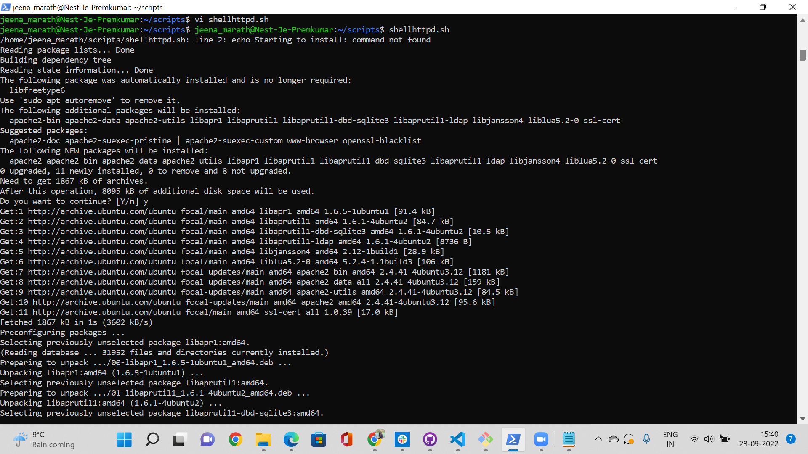
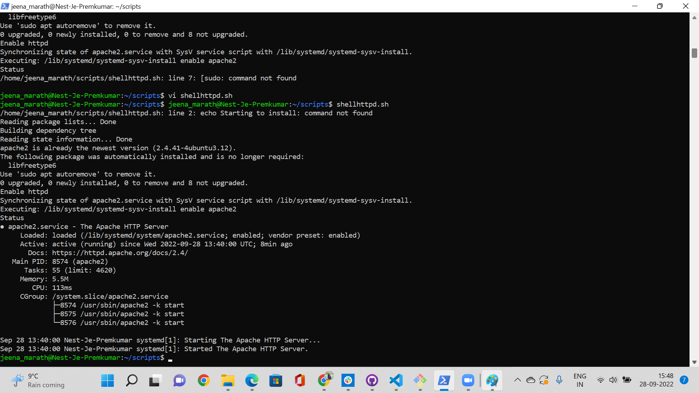
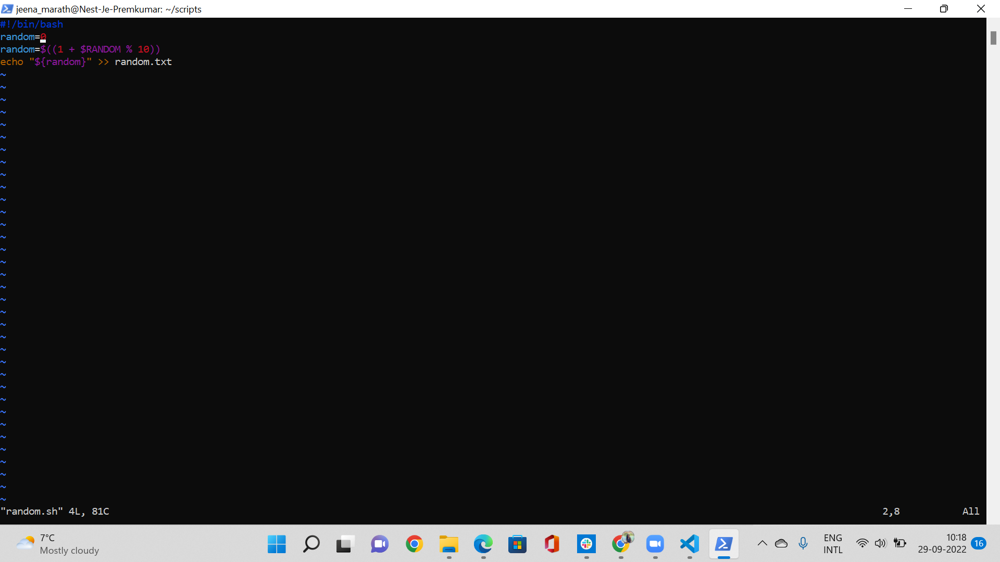
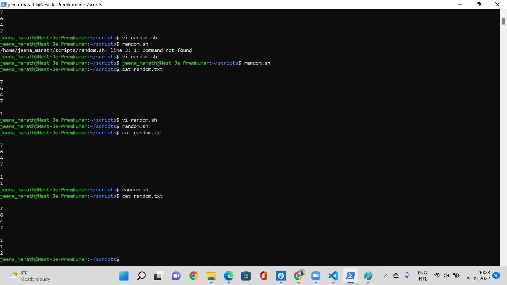
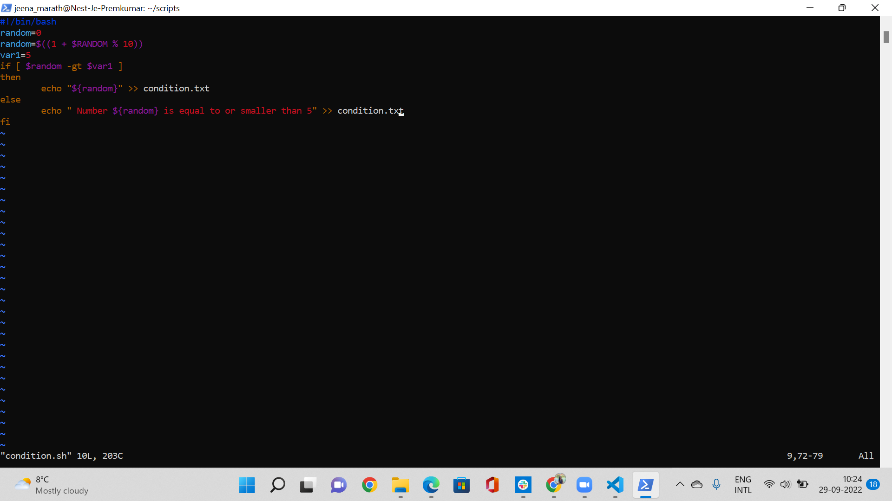
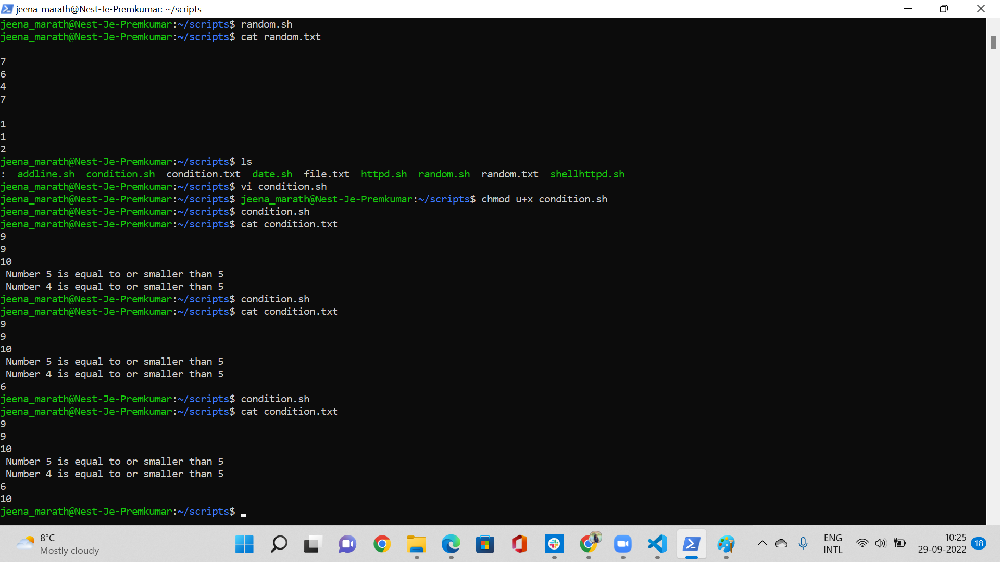

# Bash scripting
A Bash script is a series of commands written in a text file. You can execute multiple commands in a row by just executing the script.
## Key Terminologies
* Bash shell - The default coammnd line where you execute commands
* PATH - The path is the path where your scripts are written. This has to be mentioned in the environment variable PATH so that when you run a script it knows where exactly it should look for the file.
* Shell scripts - contains a sequence of commands for the linux to execute. These files have a .sh as the extension
* apt -used to install packages

## Exercise 1
- Create a directory called ‘scripts’. Place all the scripts you make in this directory.
- Add the scripts directory to the PATH variable.
- Create a script that appends a line of text to a text file whenever it is executed.
- Create a script that installs the httpd package, activates httpd, and enables httpd. Finally, your script should print the status of httpd in the terminal.

### Sources

* [PATH](https://linuxize.com/post/how-to-add-directory-to-path-in-linux/)
* [Nano Text Editior](https://linuxize.com/post/how-to-use-nano-text-editor/)

* [Append a line](https://unix.stackexchange.com/questions/567531/ways-to-append-text-to-a-file)

* [Apache status ](https://www.tecmint.com/check-apache-httpd-status-and-uptime-in-linux/)

* [Apache install](https://linuxconfig.org/apache-webserver-httpd-service-installation-on-redhat-7-linux
)
* [httpd commands](https://www.thegeekdiary.com/httpd-command-examples-in-linux/)

* [Apache install](https://techdirectarchive.com/2022/03/19/how-to-install-apache-http-server-on-ubuntu-20-04-lts/)

### Overcome challenges
 Everytime the session is closed the PATH has to be set again which can be solved if permanently placed in the /.bashrc which I didnt do as it was a little challenging, so did the export of PATH for each session.
 Nano text editor can be used for making sh files. It was initally difficult as I was more aquainted to using Vi  editor. But nano is also very easy to use.
Faced many issues with the apache2 install as I was trying with a wrong command to install, then I remembered the previous excerice and got the right command. 

 ### Results
 PATH

 

 Add line shell script

Line appending result

Apache install script

Apache installed screen

Apache installed status

## Exercise 2
- Create a script that generates a random number between 1 and 10, stores it in a variable, and then appends the number to a text file.
### Sources

* [Shell script basics](https://programming.vip/docs/shell-script-basics-start-from-scratch-the-first-shell-script.html)
* [Random number](https://stackoverflow.com/questions/1194882/how-to-generate-random-number-in-bash)

### Overcome challenges
 The expression was giving errors mainly because of the spaces in it.Once the spaces were removed and given properly the error was resolved.
 

 ### Results
Random number generation script

 

 Random number result

## Exercise 3
- Create a script that generates a random number between 1 and 10, stores it in a variable, and then appends the number to a text file only if the number is bigger than 5. If the number is 5 or smaller, it should append a line of text to that same text file instead.
### Sources

* [If else condition](https://www.educba.com/if-else-in-shell-scripting/)

*[Condition statements](https://www.linuxtechi.com/compare-numbers-strings-files-in-bash-script/#:~:text=Syntax%20of%20comparisons%20in%20shell%20script%20if%20%5B,greater%22%20else%20print%20%222%20is%20not%20greater%22%20fi)

### Overcome challenges
 Initially made some syntax error in the expression and later on was able to get it right .The space between the operators was also giving some error. Took some time to figure out the issues.
 

 ### Results
 Random number with conditon script

 

 Random number result

