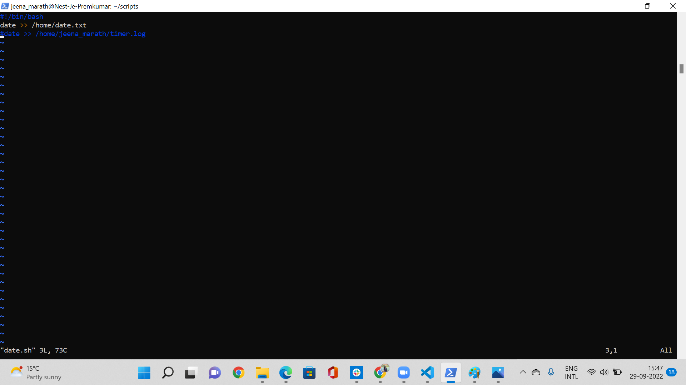
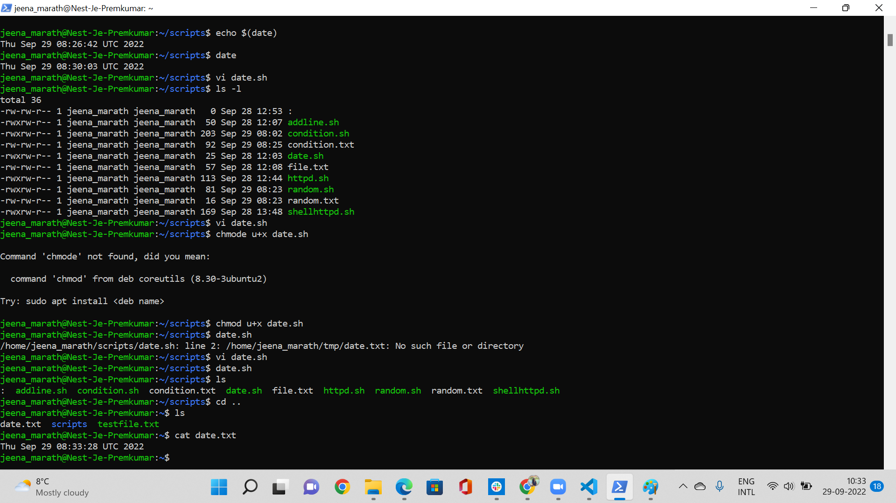
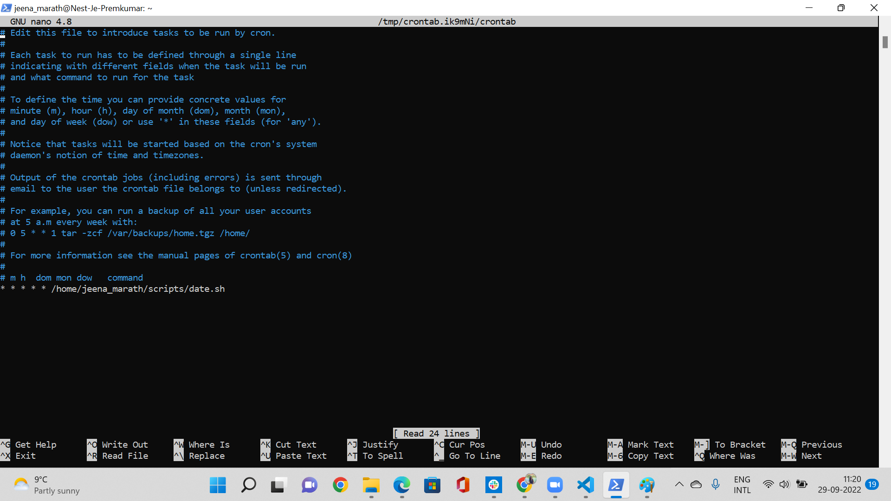
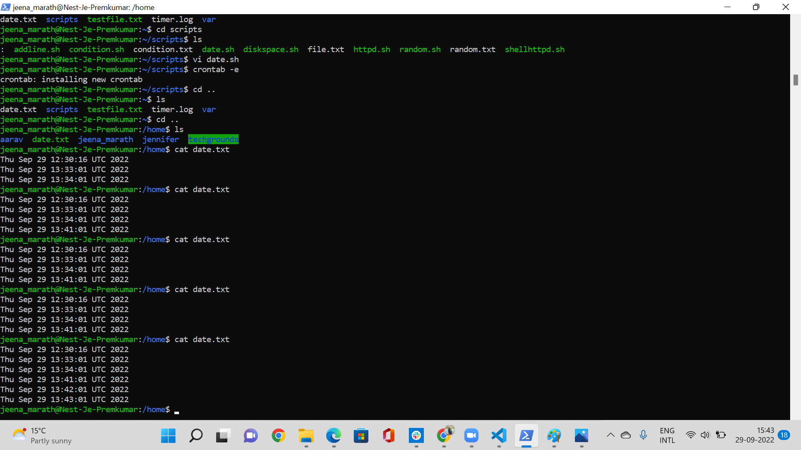
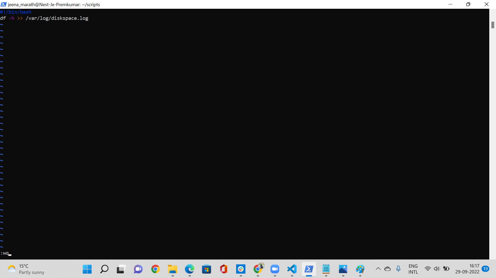
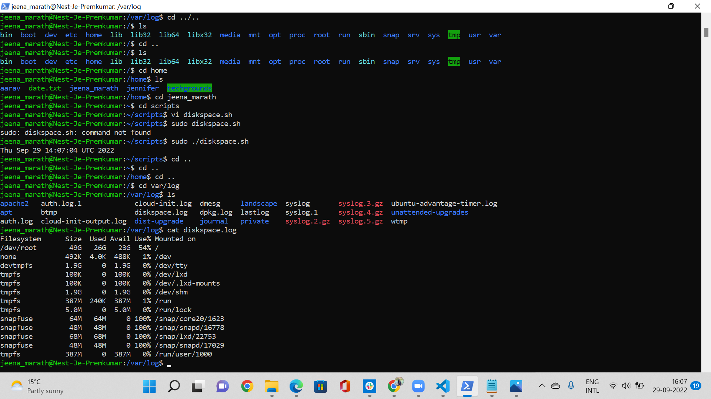
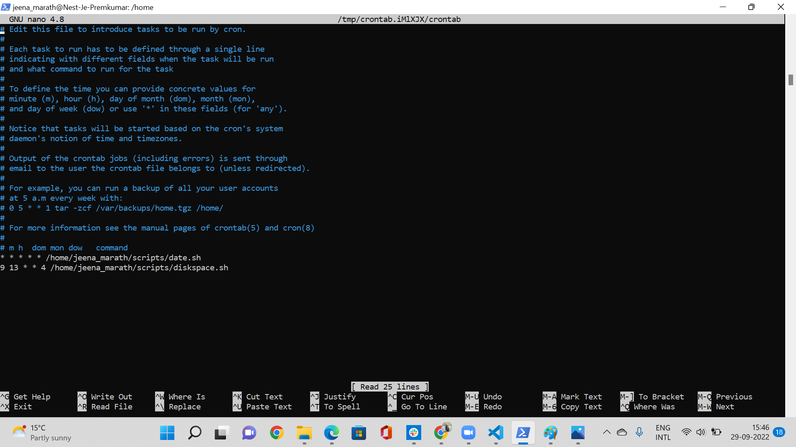
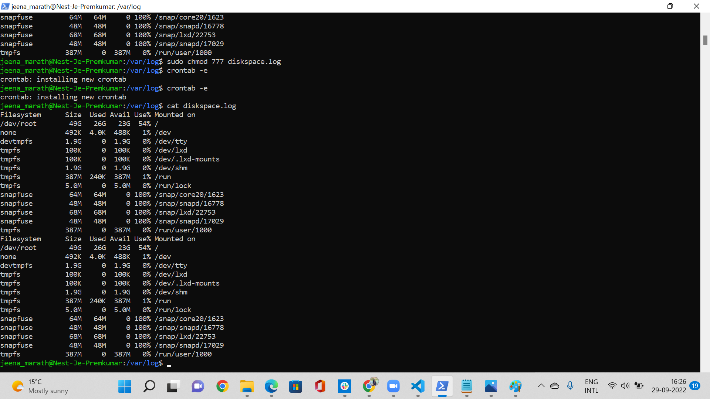

# Cron jobs
Cron jobs are scheduled jobs. Cron is a utility program that lets users input commands for scheduling tasks repeatedly at a specific time

## Key Terminologies
* Cron - The daemon which runs in the background to run the scheduled jobs
* Cron jobs - These are the scehduled tasks which the cron runs.
* Cron table - The cron tab is the file where all the cron jobs are defined and the path to the scripts given.

## Exercise 1
- Create a Bash script that writes the current date and time to a file in your home directory.
- Register the script in your crontab so that it runs every minute.
- Create a script that writes available disk space to a log file in ‘/var/logs’. Use a cron job so that it runs weekly.

### Sources

* [Cron job](hhttps://linuxhint.com/run_cron_job_every_minute/)
* [Date](https://stackoverflow.com/questions/43221469/write-current-date-time-to-a-file-using-shell-script)

* [Diskspace](https://www.geeksforgeeks.org/shell-script-to-check-disk-space-usage/)

* [Disk space ](https://www.cyberciti.biz/tips/shell-script-to-watch-the-disk-space.html)

* [Weekly cron job](https://tecadmin.net/running-crontab-every-sunday-weekly/
)

### Overcome challenges
 The weekly once cron job was challenging to get as i was testing seeing my system date and running the script. Later on I found that the vm time is different and once i set the cron job with that time testing the weekly cron job became easier. There was some issues with permissions while creating file in var/log so had to run the shell script using the sudo command.

 ### Results
 Current date and time script

 

 Date time result

Cron Job for date

Crone job result for date

Diskspace script

Diskspace result

Cron job for diskspace

Cron job result for diskspace

