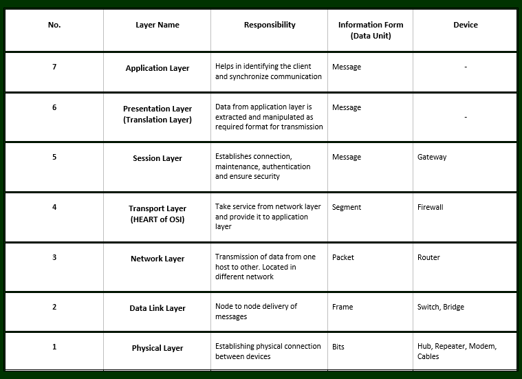

# OSI
The Open Systems Interconnection model (OSI model) is a model primarily used for troubleshooting of telecommunication or computing systems.

## Key Terminologies
* OSI 
* TCP/IP 

## Exercise 1
- The OSI model and its uses.
- The TCP/IP model and its uses.

### Sources

* [OSI Model](https://www.geeksforgeeks.org/layers-of-osi-model/)
* [OSI Model](https://www.imperva.com/learn/application-security/osi-model/)
* [OSI Model](https://www.practicalnetworking.net/series/packet-traveling/osi-model/)

* [Uses of OSI](https://www.geeksforgeeks.org/this-is-exactly-why-we-still-use-the-osi-model-when-we-have-tcp-ip-model/)

* [TCP Model ](https://www.geeksforgeeks.org/tcp-ip-model/)

* [Benefits of TCP Model](https://www.geeksforgeeks.org/tcp-ip-in-computer-networking/
)

### Overcome challenges
 

 ### Results
 OSI (Open System Interconnections) model describes seven layers that computer systems use to communicate over a network.

 1. Physical Layer (Layer 1) :It is responsible for the actual physical connection between the devices. The physical layer contains information in the form of bits (0,1). It is responsible for transmitting individual bits from one node to the next. 
    * Hub, Repeater, Modem, Cables are Physical Layer devices.
    * Network Layer, Data Link Layer, and Physical Layer are also known as Lower Layers or Hardware Layers.

 2. Data Link Layer (DLL) (Layer 2) :The data link layer is responsible for the node-to-node delivery of the message. When a packet arrives in a network, it is the responsibility of DLL to transmit it to the Host using its MAC (Media Access Control)address. The sender and receiver MAC address are encapsulated with the header of the message.
    * Packet in Data Link layer is referred to as Frame. 
    * Data Link layer is handled by the NIC (Network Interface Card) and device drivers of host machines. 
    * Switch & Bridge are Data Link Layer devices.

 3. Network Layer (Layer 3) :The network layer works for the transmission of data from one host to the other located in different networks. It also takes care of packet routing i.e. selection of the shortest path to transmit the packet, from the number of routes available. The sender & receiver’s IP addresses are placed in the header by the network layer. 
    * Segment in Network layer is referred to as Packet. 
    * Network layer is implemented by networking devices such as routers. 

4. Transport Layer (Layer 4) :The transport layer provides services to the application layer and takes services from the network layer. The data in the transport layer is referred to as Segments. It is responsible for the End to End Delivery of the complete message. It also adds Source and Destination port numbers in its header.
    * Data in the Transport Layer is called as Segments.
    * Transport layer is operated by the Operating System. It is a part of the OS and communicates with the Application Layer by making system calls. 
Transport Layer is called as Heart of OSI model

5. Session Layer (Layer 5) :This layer is responsible for the establishment of connection, maintenance of sessions, authentication, and also ensures security. 

6. Presentation Layer (Layer 6):The presentation layer is also called the Translation layer. The data from the application layer is extracted here and manipulated as per the required format to transmit over the network. The functions of the presentation layer are Translation,Encryption/Decryption and Compression.

7. Application Layer (Layer 7) :At the very top of the OSI Reference Model stack of layers, we find the Application layer which is implemented by the network applications. These applications produce the data, which has to be transferred over the network. This layer also serves as a window for the application services to access the network and for displaying the received information to the user. 
Example: Application – Browsers, Skype Messenger, etc. 

Uses of OSI

Within a networking stack, the OSI (Open Systems Interconnection) architecture provides the principles needed to manage both technical concerns and risks.
*  Helps in identifying threats throughout our tech stack.

*  Makes it possible to have a data-focused security posture. 

* Enables cloud adoption via a security first approach

* Secures cloud infrastructure as well 

 TCP/IP (Transmission Control Protocol/Internet Protocol)

 The TCP/IP model is a concise version of the OSI model. It contains four layers, unlike seven layers in the OSI model. The layers are:

 - Process/Application Layer
-  Host-to-Host/Transport Layer
- Internet Layer
- Network Access/Link Layer

Comparison of the TCP/IP and OSI model is as follows :

1. Network Access Layer –
This layer corresponds to the combination of Data Link Layer and Physical Layer of the OSI model. It looks out for hardware addressing and the protocols present in this layer allows for the physical transmission of data.It is described as residing in layer 3, being encapsulated by layer 2 protocols.

2. Internet Layer –
This layer parallels the functions of OSI’s Network layer. It defines the protocols which are responsible for logical transmission of data over the entire network.The main protocols residing at this layer are :IP,ICMP(Internet Control Message Protocol) ,ARP( Address Resolution Protocol)

3. Host-to-Host Layer –
This layer is analogous to the transport layer of the OSI model. It is responsible for end-to-end communication and error-free delivery of data. It shields the upper-layer applications from the complexities of data. The two main protocols present in this layer are :TCP(Transmission Control Protocl),UDP(User Datagram Protocol)

4. Application Layer –
This layer performs the functions of top three layers of the OSI model: Application, Presentation and Session Layer. It is responsible for node-to-node communication and controls user-interface specifications. Some of the protocols present in this layer are: HTTP, HTTPS, FTP, TFTP, Telnet, SSH, SMTP, SNMP, NTP, DNS, DHCP, NFS, X Window, LPD.

Benefits of TCP/IP
* It is an industry–standard.

* It is interoperable, i.e., it permits cross-platform communications among heterogeneous networks.

* It is an open convention suite. It isn’t claimed by any specific established and so can be utilized by any individual or organization.

* It may be versatile, client-server engineering. This permits systems to be included without disturbing the current services.

* It allots an IP address to each computer on the organization.