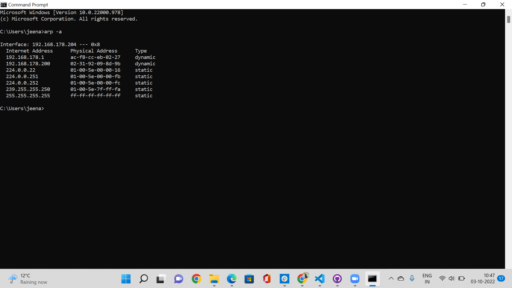
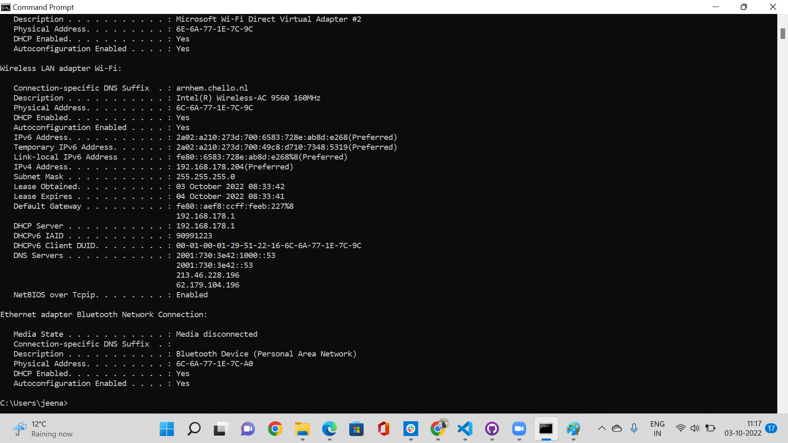

# Network Devices
The Network devices are devices that are used to connect different hosts(computers) over a network for communicating between these hosts..

## Key Terminologies
* Router
* Switch
* Gateway

## Exercise 1
- Name and describe the functions of common network devices
- Most routers have a list of all connected devices, find this list. What other information does the router have about connected devices?
- Where is your DHCP server on your network? What are its configurations?

### Sources

* [Network Devices 1](https://testbook.com/learn/types-of-computer-network-devices/)
* [Network Devices 2](https://www.tutorialspoint.com/communication_technologies/communication_technologies_network_devices.htm)
* [Network Devices 3](https://www.scaler.com/topics/computer-network/network-devices/)
* [Network Devices 4](https://www.practicalnetworking.net/series/packet-traveling/key-players/)

* [Find all connected devices](https://www.iottechtrends.com/find-all-devices-connected-router/)

* [DHCP ](https://gonocode.net/where-should-dhcp-servers-be-located/#:~:text=If%20you%20run%20a%20network%20based%20on%20Routers%2C,should%20be%20placed%20always%20at%20a%20centralised%20spot.)

* [DHCP](https://www.lifewire.com/ip-config-818377
)

### Overcome challenges
 

 ### Results

 #### Question 1
 
 
 Network Devices

 Repeater:

 It regenerates the signal. If we are connecting 2 devices over a network which are far apart by the time the data reaches the second device from the first the data decays , so in this scenario repeaters are used.It works in the Physical layer(layer 1) of OSI model.

 Hub:

 Hubs are simply mutli port repeaters.It faciliates scaling communication  between additional hosts.But the problem in hub is that every host receives everyone's data.It works in the Physical layer(layer 1) of OSI model.

 Bridges:

 The bridges comes in to picture to solve the problem of Hub. The hosts which need to communicate are connected by different set of hubs and these hubs are connected to a bridge.Bridge sits between hub connected hosts.Bridges have 2 ports,one facing one set of hub connected devices and other facing the other set of hub connected devices.Bridge knows which hosts are on each side, so only if needed it send data to host connected to other side of the hub, it send data via the bridge.It works in the Data Link layer (layer 2) of OSI model.

 Switches:

 Switches are a combination of hub and bridges.It has mutiple ports.It learns which hosts are on each port.So if a host want to communicate to another host , it opens the port of those 2 hosts to communicate.So Switich is a network device that facilitates communication with in a network. It works in the Data Link layer (layer 2) of OSI model.

 Router: 

 Routers are used to facilitate communication between networks.It provides traffcie control points between networks(security,filtering,redirecting).The rouers learns which network they are attached to and the knowledge of each of these different networks are called routes. These routes are stored in routing tables.The router knows the IP addresses of all the hosts in the network.The router is a Network Layer device.

Gateways:

A gateway is a network node in telecommunications that connects two networks that use different transmission protocols. Gateways serve as network entry and exit points because all data must pass through or communicate with the gateway before being routed. 

Modem:

Modem is a device that enables a computer to send or receive data over telephone or cable lines. The data stored on the computer is digital whereas a telephone line or cable wire can transmit only analog data.The main function of the modem is to convert digital signal into analog and vice versa.

Access point:

A wireless device is typically meant by the term access point (AP), even though it technically refers to a wired or wireless connection. The Data Link layer of the OSI model is where an access point (AP) operates. An access point can function as a router or bridge, passing data transmissions from one access point to another. 

 #### Question 2

To know the devices connected to the router you can use the command arp -a on the command prompt.
The ipconfig command will give you the gateway ip address which can be entered on the browser and once you login to the router you will be able to see thee connected devices on the router.
The other information you can see on the list is the MAC address, ip address and the speed.

 #### Question 3

 DHCP server configuration
 
In a home network the router serves as the DCHP Server.
To see the DHCP configuration you can run the command ipconfig /all .It will give the DHCP  status, server, etc

 
