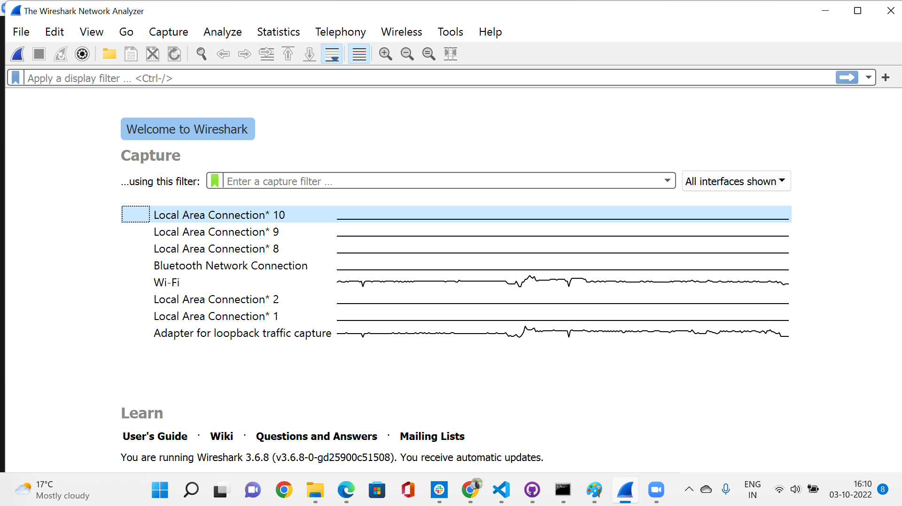
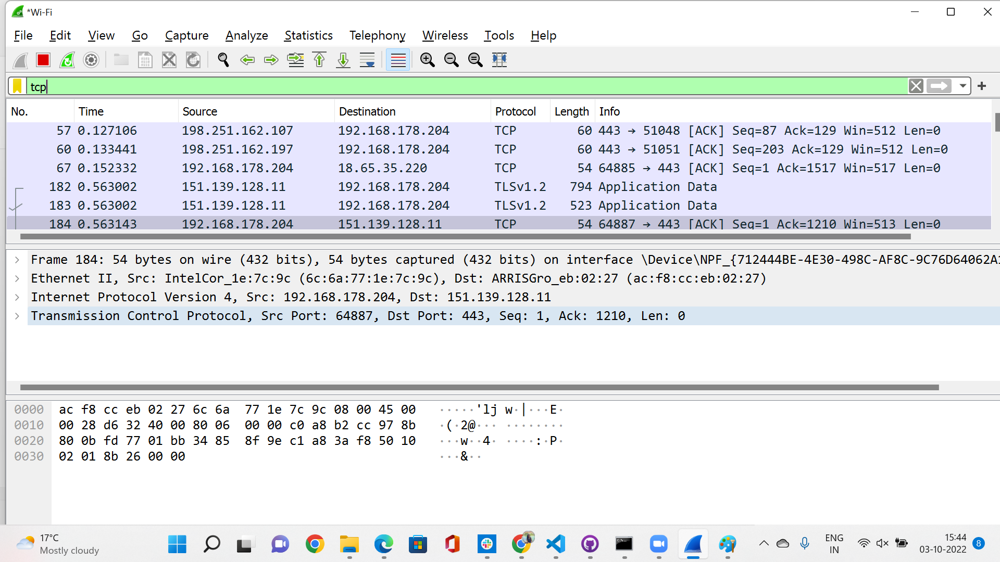
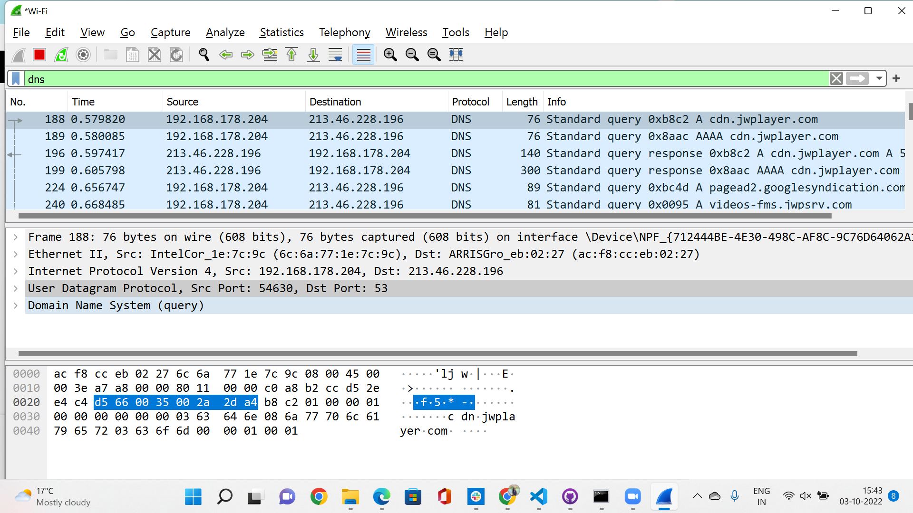

# Protocols
A network protocol is an agreement about how to communicate. There are protocols on every layer of the OSI stack.

## Key Terminologies
* Protocol -A network protocol is an accepted set of rules that govern data communication between different devices in the network
* Wireshark - It is an open-source packet analyzer, which is used for education, analysis, software development, communication protocol development, and network troubleshooting

## Exercise 1
- Identify several other protocols and their associated OSI layer. Name at least one for each layer.
- Figure out who determines what protocols we use and what is needed to introduce your own protocol.
- Look into wireshark and install this program. Try and capture a bit of your own network data. Search for a protocol you know and try to understand how it functions.

### Sources

* [Protocols](http://www.vidyagyaan.com/computer-knowledge/the-seven-layers-of-osi-model-their-protocols-and-functions/)
* [Protocols](https://www.guru99.com/layers-of-osi-model.html)
* [Protocols Defined](https://www.comptia.org/content/guides/what-is-a-network-protocol#:~:text=The%20following%20groups%20have%20defined%20and%20published%20different,Union%20%28ITU%29%20The%20World%20Wide%20Web%20Consortium%20%28W3C%29)

* [Custom protocols](https://softwareengineering.stackexchange.com/questions/366134/can-someone-implement-a-custom-network-protocol)
* [OSI protocols](https://en.wikipedia.org/wiki/OSI_protocols)

* [QUIC](https://en.wikipedia.org/wiki/QUIC)

* [Wireshark ](https://wiki.wireshark.org/CaptureFilters)

* [Wireshark download](https://www.wireshark.org/)

### Overcome challenges
 
The second question wasnt very clear and we were looking for more solutions on the same, but after the scrum meeting was able to conclude that what we have understood the question correctly and the answer was the same.

 ### Results

#### Question 1

Layer 7	Application	-SMTP, HTTP, FTP, POP3, SNMP,DHCP,Telnet
    
- FTP (File Transfer Protocol):It helps to transfer files between any 2 hosts on a network.
- SMTP ( Simple Mail Transfer Protocol) : It is used to transfer the mails. 
- HTTP (Hyper Text Transfer Protocol) :
- SNMP (Simple network management protocol ): It is used to collect and organize the data of managed devices on IP networks.
- DHCP (Dynamic Host Configuration Protocol) : It gives IP addresses to hosts.

Layer 6	Presentation-	SSL, TLS,MPEG, ASCII 

- SSL(Secure Socket Layer): It  provides security to the data that is being transferred between the web browser and the server.
- TLS(Transport Layer Security) :It is a security protocol designed to facilitate privacy and data security for communications over the Internet.

Layer 5	Session	-RPCP,PPTP ,PAP,SDP, SAP

- PAP(Password Authentication Protocol): It is a password-based authentication protocol used by Point to Point Protocol (PPP) to validate users. 
- PPTP(Point-to-Point Tunneling Protocol ):It is a protocol which provides a method for implementing virtual private networks. 
- RPCP( Remote Procedure Call Protocol):It is a protocol that is used when a computer program causes a procedure (or a sub-routine) to execute in a different address space without the programmer explicitly coding the details for the remote interaction. 

Layer 4	Transport -	TCP, UDP

- UDP(User Datagram Protocol): It is a transport-level end-to-end protocol that adds addresses of transport-level, control of errors in the checksum, and data lengths from the top laying. 
- TCP(Transmission Control Protocol) :It is a connection-oriented transport protocol. TCP is a protocol that specifies how network connections can be developed and maintained under which applications can share data. 

Layer 3	Network	- IPV4, IPV6, ICMP, ARP

- ARP(Address Resolution Protocol)
- ICMP(Internet Control Message Protocol): It is a network diagnostic and error reporting protocol.
- IPV4 (Internet Protocol Version 4) :IPv4 is 32-bit addressing scheme used as TCP/IP host addressing mechanism. IP addressing enables every host on the TCP/IP network to be uniquely identifiable.

Layer 2	Data Link -	SDLC,HDLC,SLIP,PPP

- SDLC (Synchronous Data Link Protocol ):SDLC is basically a communication protocol of computer. It usually supports multipoint links even error recovery or error correction also. It is usually used to carry SNA (Systems Network Architecture) traffic and is present precursor to HDLC. 
- HDLC (High-Level Data Link Protocol):HDLC is basically a protocol that is now assumed to be an umbrella under which many Wide Area protocols sit.
- SLIP(Serial Line Interface Protocol ):SLIP is generally an older protocol that is just used to add a framing byte at end of IP packet. It is basically a data link control facility that is required for transferring IP packets usually among Internet Service Providers (ISP) and a home user over a dial-up link. 
- PPP(Point to Point Protocol):PPP is a protocol that is basically used to provide same functionality as SLIP. It is most robust protocol that is used to transport other types of packets also along with IP Packets.

Layer 1	Physical -	RS232

- RS232 - RS232 Communication protocol is an old serial communication protocol. Modern hardware designs use innovative serial communication protocols like USB, Ethernet, and Wi-Fi. 

#### Question 2

Network protocols are typically created according to industry standard by various networking or information technology organizations.

The following groups have defined and published different network protocols:

- The Institute of Electrical and Electronics Engineers (IEEE)
- The Internet Engineering Task Force (IETF)
- The International Organization for Standardization (ISO)
- The International Telecommunications Union (ITU)
- The World Wide Web Consortium (W3C)

If we have to create a new protocol , it has be created in line with the existing protocols so that it works along with the existing protocol. The new protocol's Internet Draft with the specification has to be submitted to any of the organizations that standardizes the protocol like IETF. The organization will review it and decide.Once its approved , it will be made as a worldwide standard. One such example is QUIC.

#### Question 3

Wireshark capture of the network data

Wireshark capture of TCP 

Wireshark capture of DNS 

