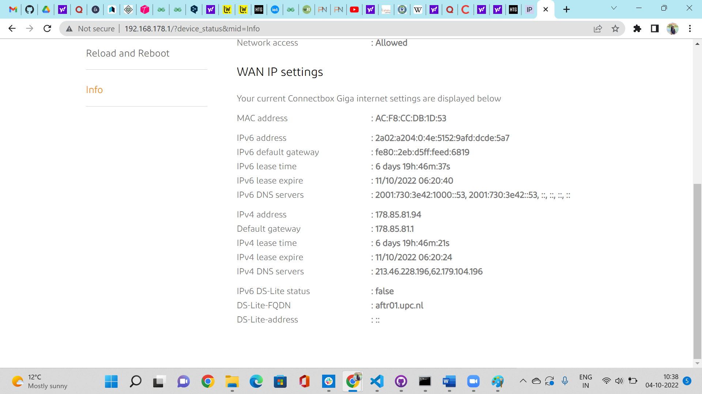
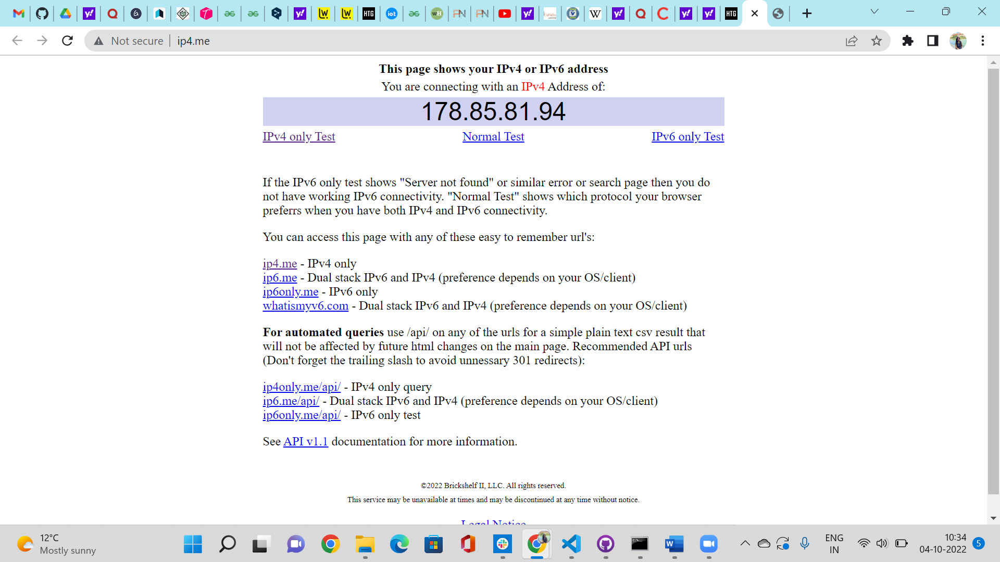
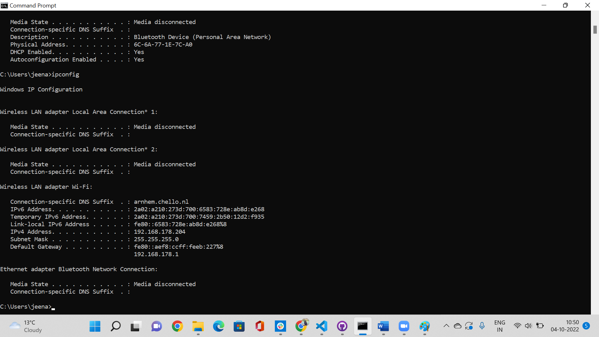

# IP Address
An Internet Protocol address (IP address) is a numerical label such as 192.0.2.1 that is connected to a computer network that uses the Internet Protocol for communication.

## Key Terminologies
* IP address -An IP address is assigned to each device connected to a network. Each device uses an IP address for communication. It also behaves as an identifier as this address is used to identify the device on a network. 
* IPv4 vs IPv6-
    An IPv4 address (Internet Protocol version 4) comprises four sets of numbers, each ranging from 0 to 255, which are separated by periods.
    IPv6, was first introduced in the late 1990s as a replacement for IPv4. It uses 128-bit addresses formatted as eight groups of four hexadecimal numbers separated by colons. IPv6 is the solution that addresses the relatively limited number of IP addresses possible under IPv4.
* Public and Private IPs -Private IP address of a system is the IP address that is used to communicate within the same network. Using private IP data or information can be sent or received within the same network. Public IP address of a system is the IP address that is used to communicate outside the network. A public IP address is basically assigned by the ISP (Internet Service Provider). 
* NAT- Network Address Translation (NAT) is a process in which one or more local IP address is translated into one or more Global IP address and vice versa in order to provide Internet access to the local hosts. Also, it does the translation of port numbers i.e. masks the port number of the host with another port number, in the packet that will be routed to the destination.
* Static and Dynamic IP -A static IP address is simply an address that doesn't change. Dynamic addresses are dynamic and assigned, as needed, by Dynamic Host Configuration Protocol (DHCP) servers.

## Exercise 

- Find out what your public IP address is of your laptop and mobile on wifi.
- Are the addresses the same or not? Explain why.
- Find out what your private IP address is of your laptop and mobile on wifi.
- Are the addresses the same or not? Explain why.
- Change the private IP address of your mobile to that of your laptop. What happens next?
- Try changing the private IP address of your mobile to an address outside your network. What happens next?

### Sources

* [Find private and public IP](https://www.howtogeek.com/117371/how-to-find-your-computers-private-public-ip-addresses/)
* [Change IP address](https://www.purevpn.com/blog/change-ip-address-android-devices/)
* [Change IP address 2](https://www.makeuseof.com/tag/find-ip-address-mobile-smartphone/)

* [What is my IP](https://www.whatismyip.com/)

* [Private IP address](https://www.geeksforgeeks.org/private-ip-addresses-in-networking/)
* [IPV4 vs IPV6](https://www.avast.com/c-ipv4-vs-ipv6-addresses)
* [NAT](https://www.geeksforgeeks.org/network-address-translation-nat/)
* [NAT2](https://www.educba.com/what-is-nat/)
* [Static vs Dynamic Address](https://www.avast.com/c-static-vs-dynamic-ip-addresses)

### Overcome challenges
 The changing of Ip address on phone was a little challenging as the results wasnt seen when the IP address alone was changed.The gateway and ip address change was only able to make a difference in the results and the understanding of the results.

 ### Results

#### Question 1

Public address of both laptop and phone are same. The public address is the address that you receive for your router from the Internet service provider,which is used when you access the internet. So it will be same for allthe devices connected to your home router.

#### Question 2

Private ip address are different for laptop and mobile phone.These addresses are basically assigned by the network router to your particular device. The unique private IP address is provided to every device which is on the same network.

#### Question 3

When ip address of the mobile was changed to that of the laptop it was connecting to the network .

#### Question 4

When ip address of the mobile was changed to outside of your network it wont be able to connect to the network. As the public ip address is changed and the gateway address is also changed this makes it impossible for the mobile phone to access the internet.

