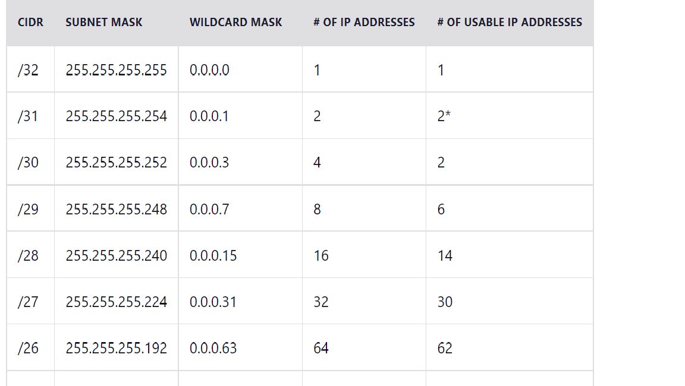
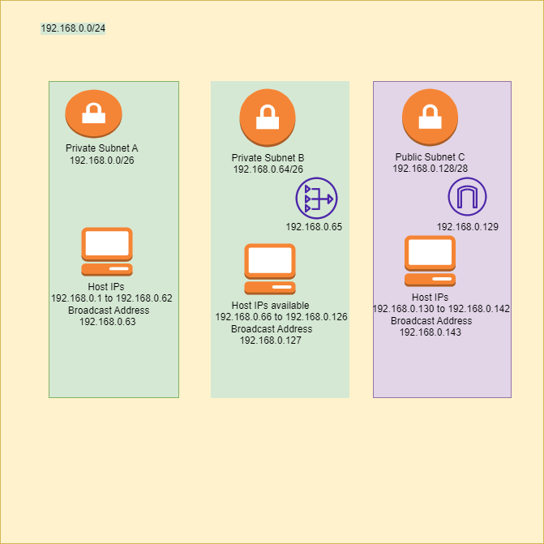

# Subnetting
A subnet, or subnetwork, is a network inside a network. Subnets make networks more efficient. Through subnetting, network traffic can travel a shorter distance without passing through unnecessary routers to reach its destination.

## Key Terminologies
* Subnet -A subnet, or subnetwork, is a network inside a network. Subnets make networks more efficient. Through subnetting, network traffic can travel a shorter distance without passing through unnecessary routers to reach its destination.
Every group of ip addresses ina subnet , has a Subnet Address, Broadcast Address, and Gateway.

* Subnet mask -A subnet mask is like an IP address, but for only internal usage within a network. Routers use subnet masks to route data packets to the right place.
* CIDR - Classless Inter-Domain Routing (CIDR) block. E.g., 172.31.0.0/16 is the primary CIDR block .A subnet is a range of IP addresses and this range is calculated using the CIDR block.

## Exercise 
- Create a network architecture that meets the following requirements:
1 private subnet accessible only from within the LAN. This subnet must be able to accommodate a minimum of 15 hosts.
1 private subnet that has Internet access through a NAT gateway. This subnet must be able to accommodate a minimum of 30 hosts (the 30 hosts does not include the NAT gateway).
1 public subnet with an internet gateway. This subnet must be able to accommodate a minimum of 5 hosts (the 5 hosts does not include the internet gateway).
- Post the architecture you created including a brief explanation in the Github repository you shared with the learning coach.

### Sources

* [Subnetting 1](https://subnettingpractice.com/how-to-subnet.html)
* [Subnetting video link](https://www.youtube.com/watch?v=BWZ-MHIhqjM&t=0s)
* [Subnetting 2](https://www.cloudflare.com/learning/network-layer/what-is-a-subnet/)

* [Subnet calculator](https://networkcalc.com/subnet-calculator/10.0.0.0/26)
* [Subnet calculator](https://subnettingpractice.com/subnet-calculator.html)

* [Subnet Explained](https://portforward.com/networking/subnetting/#:~:text=The%20gateway%20can%20be%20on%20any%20ip%20address,always%20on%20the%20last%20one%20in%20the%20range.)

* [Public Subnet](https://docs.cherryservers.com/knowledge/public-ip-subnet)
* [Subnet NAT Gateway](https://medium.com/analytics-vidhya/providing-internet-connectivity-to-private-subnet-through-nat-gateway-edf6955f8cea)
* [Internet vs NAT gateway](https://www.learnaws.org/2022/06/30/internet-vs-nat-gateway/)

### Overcome challenges

 Understanding the subnetting topic and drawing the network diagram was a little challenging and took more time than expected. The diagram also had to be drawn many times as i missed to see the template given in the exercise . Intially i drew the diagram not considering the clod scenario, then later changed to the cloud scenario. The correct representation of the images are still not clear, but the subnetting and the assignment of address to various components was done as per the understanding. 

 ### Results

 The number of  hosts/ip addresses needed is 50, from the cheat sheet i take number 64, which gives me a CIDR number as 26 and subnte address as 255.255.255.192.
 

In this network I need 3 subnets. Im going to use 192.168.0.0/24 as the starting network address. This Im going to divide to 3 subnets.

For each subnet, the subnet address and broadcast address cannot be used for host addresses. The subnet adress will be the first address in the subnet, broadcast will be the last address in the subnet and the remaining address coming in between are the usable host addresses. But when we need to use NAT gateway and internet gateway one more address from the subnet, usually the first address after the subnet address are used for those.The broadcast address+1 will be the subnet address of the next subnet address.

For the private subnet A ,Im using the CIDR as 26, the subnet will have 62 usable host addresses, its subnet address is 192.168.0.0/26

For the private subnet B, Im using CIDR as 26, the subnet will have 61 usable host addresses( as one is taken for the NAT gateway also ) its subnet address is 192.168.0.64/26. 

For the public subnet C, Im using CIDR as 28, the subnet will have 13 usable host addresses ( as one is taken for the internet gateway also), its subnet address is 192.168.0.128/28.

