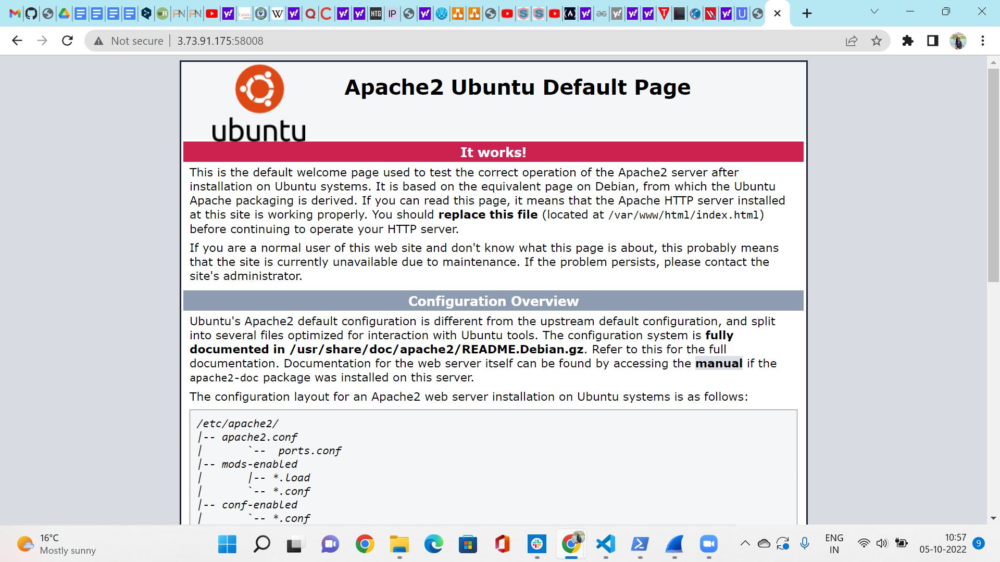
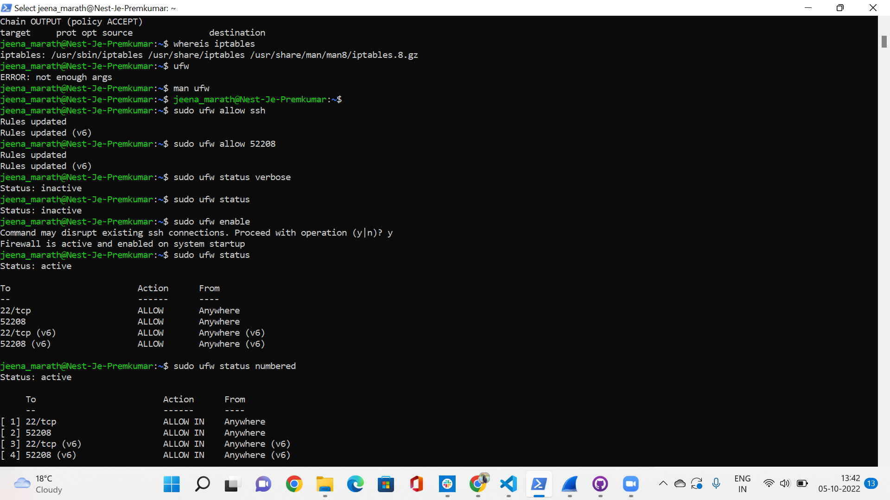
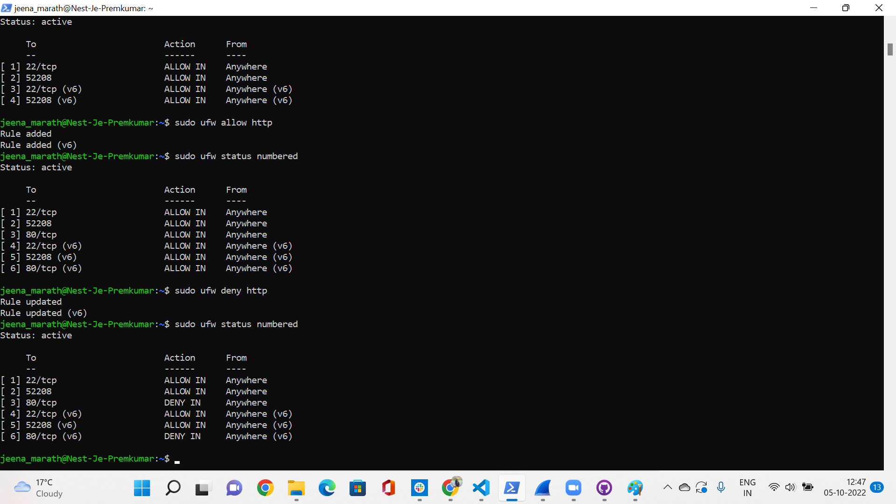
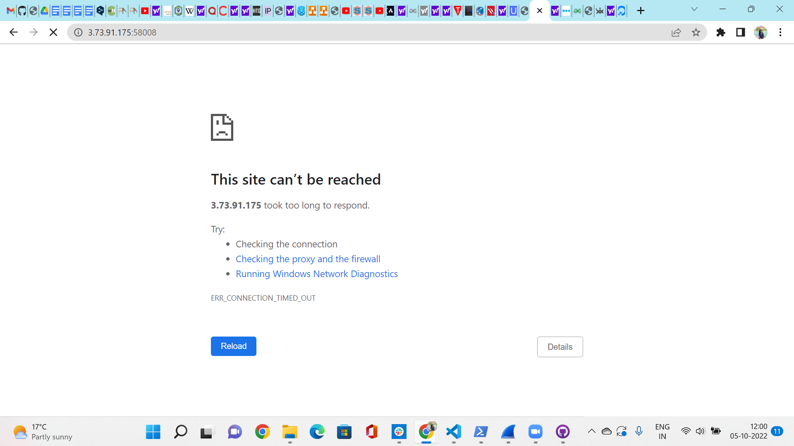
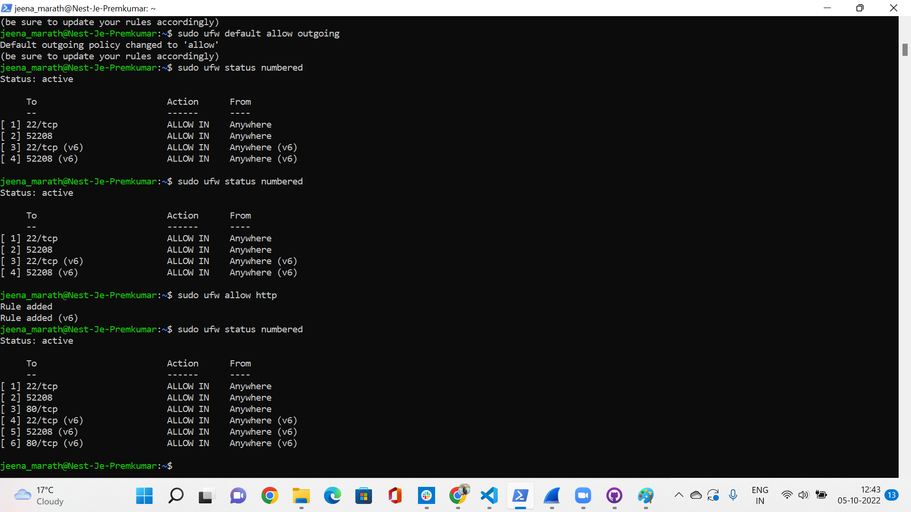

# Firewalls
A firewall is an essential layer of security that acts as a barrier between private networks and the outside world. 
A firewall is a security tool that monitors incoming and/or outgoing network traffic to detect and block malicious data packets based on predefined rules, allowing only legitimate traffic to enter your private network. Implemented as hardware, software, or both, firewalls are typically your first line of defense against malware, viruses, and attackers trying to make it to your organization’s internal network and systems.

## Key Terminologies
* Software Firewall -Software firewalls are installed separately on individual devices.
* Hardware Firewall -Hardware firewalls are physical devices, each with its computing resources. They act as gateways between internal networks and the internet, keeping data packets and traffic requests from untrusted sources outside the private network.
* Stateful Firewall - A stateful firewall inspects everything inside data packets, the characteristics of the data, and its channels of communication. Stateful firewalls examine the behavior of data packets, and if anything seems off, they can filter out the suspicious data.
* Stateless Firewall - Stateless firewalls make use of a data packet's source, destination, and other parameters to figure out whether the data presents a threat. There are certain preset rules that firewalls enforce while deciding whether traffic must be permitted or not.
* UFW - UFW, or Uncomplicated Firewall, is a simplified firewall management interface that hides the complexity of lower-level packet filtering technologies such as iptables and nftables.
* firewalld -Is a firewall daemon installed by default in CentOS and REHL.

## Exercise 

- Install a web server on your VM.
- View the default page installed with the web server.
- Set the firewall to block web traffic but allow ssh traffic.
- Verify that the firewall is doing its job.

### Sources

* [Firewall Types](https://www.parallels.com/blogs/ras/types-of-firewalls/)
* [Firewall](https://www.fortinet.com/resources/cyberglossary/stateful-vs-stateless-firewall)
* [UFW details](linux.com/training-tutorials/introduction-uncomplicated-firewall-ufw/)
* [Firewall Types 2](https://geekflare.com/stateful-vs-stateless-firewalls/)

* [Settingup Firewall](https://www.digitalocean.com/community/tutorials/how-to-set-up-a-firewall-with-ufw-on-ubuntu-20-04)

### Overcome challenges

 ### Results

 The installation of Apache 2 was done in previous excercises. Check the status of the apache 2 to see its still running and give the host and the port number in the web browser to see if its working.
 
 The below page will appear if its working 

 

For setting up the firewall first we need to check if UFW is installed. Most of the times UFW is installed by default on Ubuntu.
Enable your ufw using the command sudo ufw enable

Allowing SSH Connections

If we enabled our UFW firewall now, it would deny all incoming connections. This means that we will need to create rules that explicitly allow legitimate incoming connections — SSH or HTTP connections.

To see the status ufw , use the command sudo ufw status numbered

Tos enable SSH , use the command sudo ufw allow ssh / sudo ufw allow 52208 (if the ssh port is different than the default port)

To set the firewall for the web traffic , you have to use the command sudo ufw deny http

When you do that the web page will not be opened :

To enable again the http you can  use the command sudo ufw allow http

