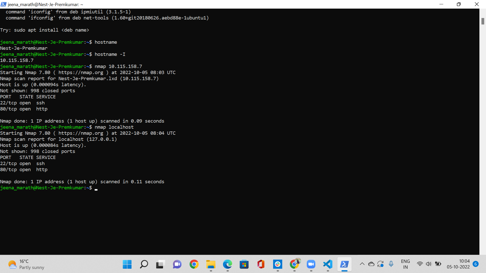
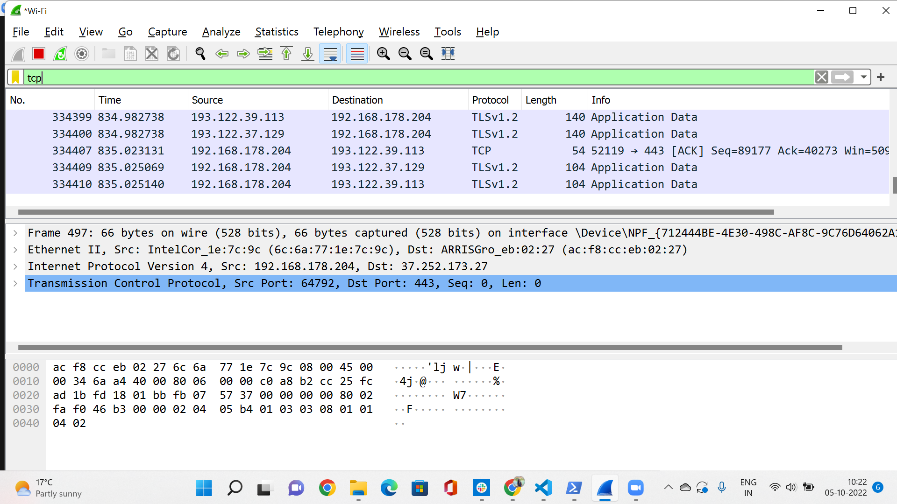

# Network detection
There are many tools to detect your netwrok to prevent or stop any attack on the network. In this we are going to see 2 of those nmap and wireshark.

## Key Terminologies
* nmap -Network Mapper (Nmap) is a free, open-source network security scanning tool. By sending IP packets and analyzing the responses, Nmap can discover information about hosts and services on remote computer networks.
* Wireshark -Wireshark is an open-source packet analyzer, which is used for education, analysis, software development, communication protocol development, and network troubleshooting.

## Exercise 

- Scan the network of your Linux machine using nmap. What do you find?
- Open Wireshark in Windows/MacOS Machine. Analyse what happens when you open an internet browser. (Tip: you will find that Zoom is constantly sending packets over the network. You can either turn off Zoom for a minute, or look for the packets sent by the browser between the packets sent by Zoom.)

### Sources

* [Nmap](https://www.osradar.com/install-use-nmap-linux/)
* [Nmap install](https://phoenixnap.com/kb/how-to-install-use-nmap-scanning-linux)

* [Wireshark tutorial](https://www.varonis.com/blog/how-to-use-wireshark#packets)
* [Wireshark](https://www.javatpoint.com/wireshark)

### Overcome challenges

 ### Results

 In order to scan the network first we need to install the nmap on the Linux machine. To scan the machine, you can use nmap localhost 
 or the  command nmap ipaddress. To get the ipaddress you can use the command hostname -I.

To see the traffic of the browser on the wireshark , you can filter the TCP protocol.

