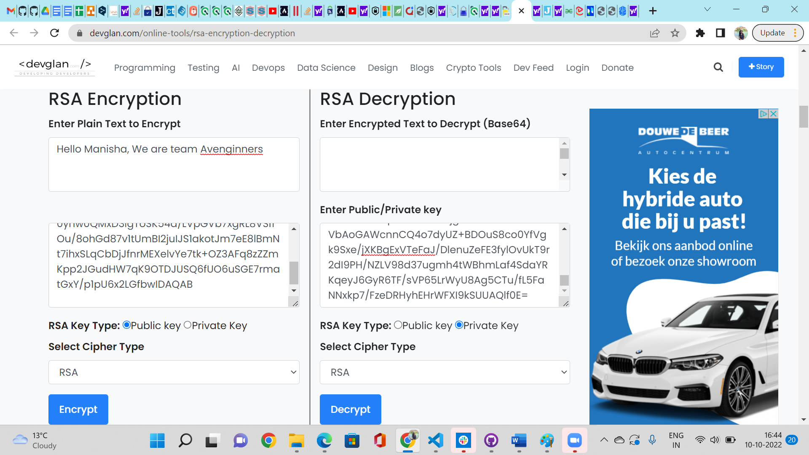

# Asymmetric encryption
Encryption is an important tool for securing data. Be it data at rest, or data in motion. A lot of what you do on your computer and the Internet is encrypted.

## Key Terminologies
* Asymmetric Encryption : Asymmetric Encryption, or Public-key Cryptography, uses a pair of keys for encrypting and decrypting messages. This key pair is mathematically related to each other with algorithms and is called the Public Key and the Private Key.

The Public Key, as the name defines is publicly available for all senders of the message who wish to secure their message with encryption. In contrast, the Private/Secret Key is secured and only accessible to the authorized recipient of the message, who can read the message by decrypting the same.

## Exercise 

- Generate a key pair.
- Send an asymmetrically encrypted message to one of your peers via the public Slack channel. They should be able to decrypt the message using a key you share with them. The recipient should be able to read the message, but it should remain a secret to everyone else.
You are not allowed to use any private messages or other communication channels besides Slack. Analyse the difference between this method and symmetric encryption.

### Sources

* [Asymmetric Encryption](https://www.clickssl.net/blog/what-is-asymmetric-encryption)
* [Asymmetric Encryption ](https://cyberexperts.com/asymmetric-encryption-example/)
* [RSA encryption/Decryption](https://www.devglan.com/online-tools/rsa-encryption-decryption)
* [RSA tool](https://www.javainuse.com/rsagenerator)

### Overcome challenges
 

 ### Results

 For anyone who want to exchange an encrypted message using an asymmetric encryption, they follow any of the standard algorithms to encrypt or decrypt the messages.
 For the asymmetric encryption both the sender and receiver should have their private and public key. First the key pair is generated using the tool.

 

 The receiver will send you the public key to you. You have to use that public key to encrypt your message as below.

 

 The encrypted message is then send to the receiver . The receiver will decrypt the message with the private key he already got. He will be able to read the encrypted message now as below.

 

