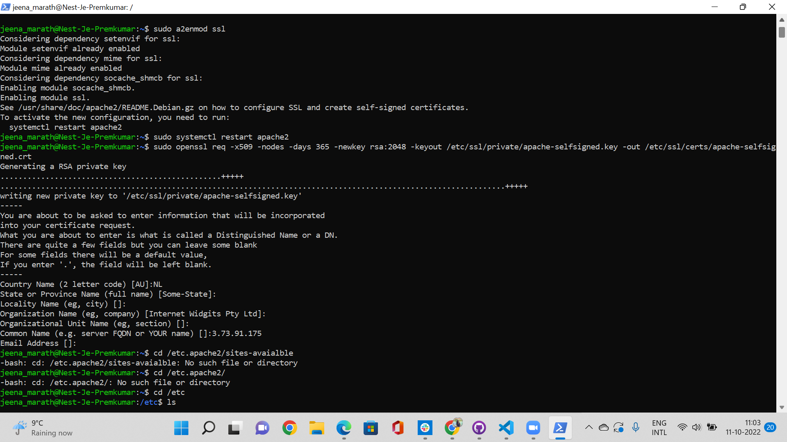
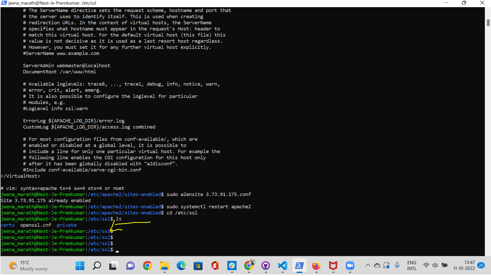
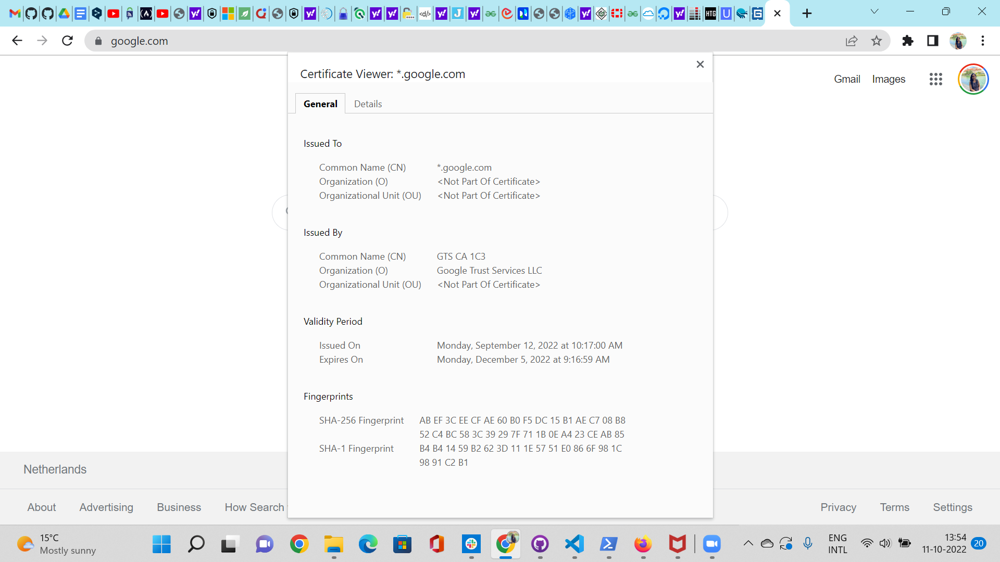
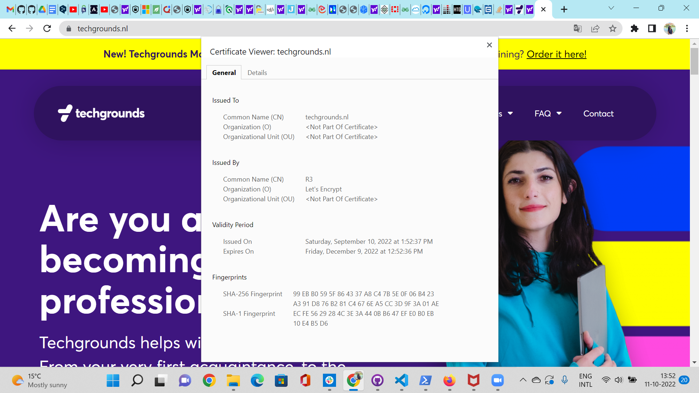
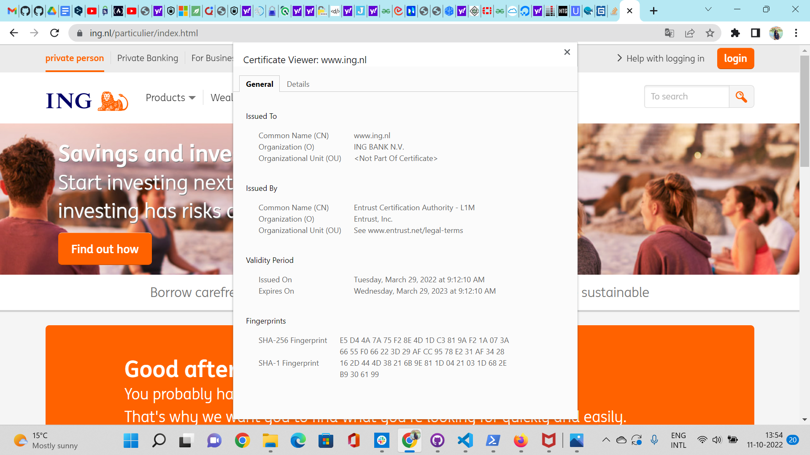
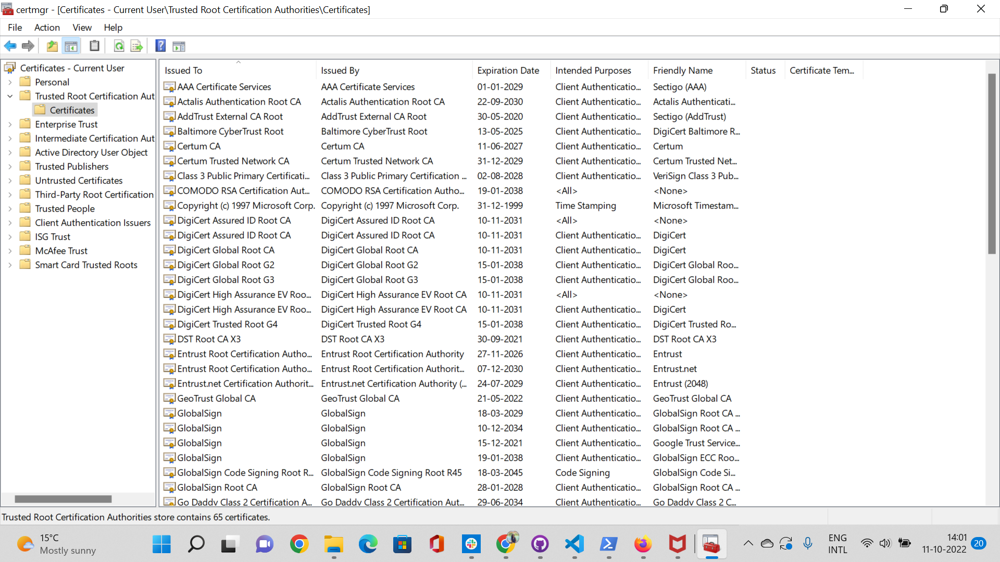
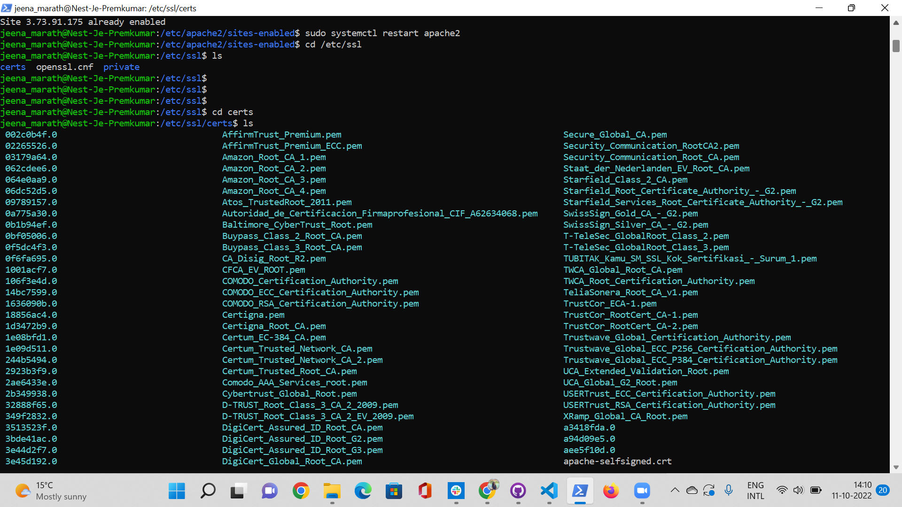
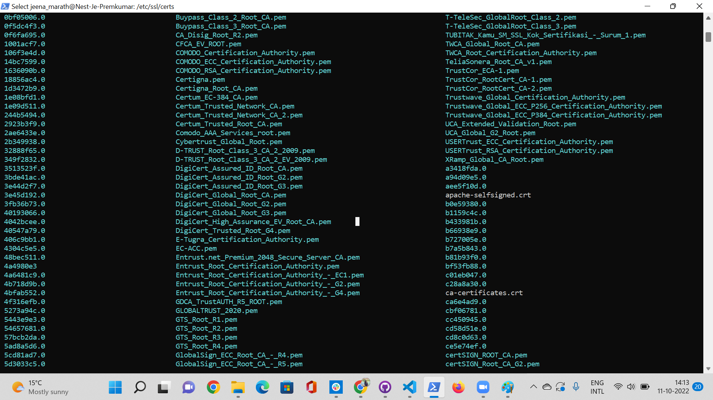

# Public Key Infrastructure
Public Key Infrastructure (PKI) is a set of roles, policies, hardware, software and procedures needed to create, manage, distribute, use, store and revoke digital certificates and manage public-key encryption.

## Key Terminologies
* Public Key Infrastructure : Public key infrastructure (PKI) refers to tools used to create and manage public keys for encryption, which is a common method of securing data transfers on the internet.PKI works through the implementation of two technologies: certificates and keys. A key is a long number used to encrypt data. Certificates, which are issued by a certificate authority (CA), let you know the person or device you want to communicate with is actually who they claim to be.

* PKI Certificate: The process of creating a certificate follows several, logical steps. First, a private key is created, which is used to calculate the public key. Then, the CA requires the private key owner's attributes presented for verification.

After that, the public key and the owner's attributes are encoded into a digital signature known as a certificate signing request (CSR). This then gets signed by the owner of the key. The signature the owner provides serves as proof that they are the rightful possessor of the private key.

The final step involves the CA. The CSR gets validated by the CA, which then also adds its own signature to the certificate using the CA’s private key. At this point, the certificate is considered legitimate, and communication can commence.

* X.509 - X.509 is a standard format for public key certificates, digital documents that securely associate cryptographic key pairs with identities such as websites, individuals, or organizations.

## Exercise 

- Create a self-signed certificate on your VM.
- Analyze some certification paths of known websites (ex. techgrounds.nl / google.com / ing.nl).
- Find the list of trusted certificate roots on your system (bonus points if you also find it in your VM).

### Sources

* [PKI](https://www.fortinet.com/resources/cyberglossary/public-key-infrastructure)
* [PKI ](https://www.tutorialspoint.com/cryptography/public_key_infrastructure.htm)
* [SSL certificate](https://ubiq.co/tech-blog/how-to-create-a-self-signed-ssl-certificate-for-apache-in-ubuntu-debian/)
* [SSL certificate 2](https://www.digitalocean.com/community/tutorials/how-to-create-a-self-signed-ssl-certificate-for-apache-in-ubuntu-20-04)
* [SSL cetificate 3](https://www.arubacloud.com/tutorial/how-to-create-a-self-signed-ssl-certificate-on-ubuntu-18-04.aspx)
* [X509](https://www.ssl.com/faqs/what-is-an-x-509-certificate/)
* [Ubuntu root certificate](https://sslhow.com/check-root-ca-certificates-in-linux)

### Overcome challenges
 

 ### Results

 #### Question 1

 We can create a self-signed key and certificate pair with OpenSSL in a single command:

 sudo openssl req -x509 -nodes -days 365 -newkey rsa:2048 -keyout /etc/ssl/private/apache-selfsigned.key -out /etc/ssl/certs/apache-selfsigned.crt
- openssl – command line tool to create self-signed certificate
- req – specifies to use X.509 standard for certificate creation, making it more secure.
-x509 – for generation of self-signed certificate as opposed to certificate signing request
-nodes – tells openSSL to secure our certificate without a passphrase
-days 365 – specifies validity of SSL certificate, that is, 365 days
-newkey rsa:2048 – tells openSSL to create certificate as well as the key together. rsa:2048 indicates that RSA key should be 2048 bits long
-keyout – location to place generated private key file
-out – location to place generated certificate

The most important line in above prompts is for Common Name (e.g server FQDN or YOUR name). Here you need to correctly specify your website’s domain or public IP address.

In our case, both the certificate and private key file will be generated at /etc/ssl.

 

 
 #### Question 2

 

 #### Question 3
 
 In windows you can see the list of trusted certificate roots by going to run and typing cert. You can then go to Manage User Certificates. In that left side you will see Trusted Root Certificates.

 

On VM you can see all the ssl certificates in /etc/ssl/certs diretory. In that the root certificates are in  ca-certificates.crt

