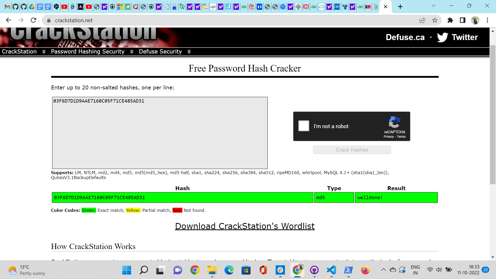
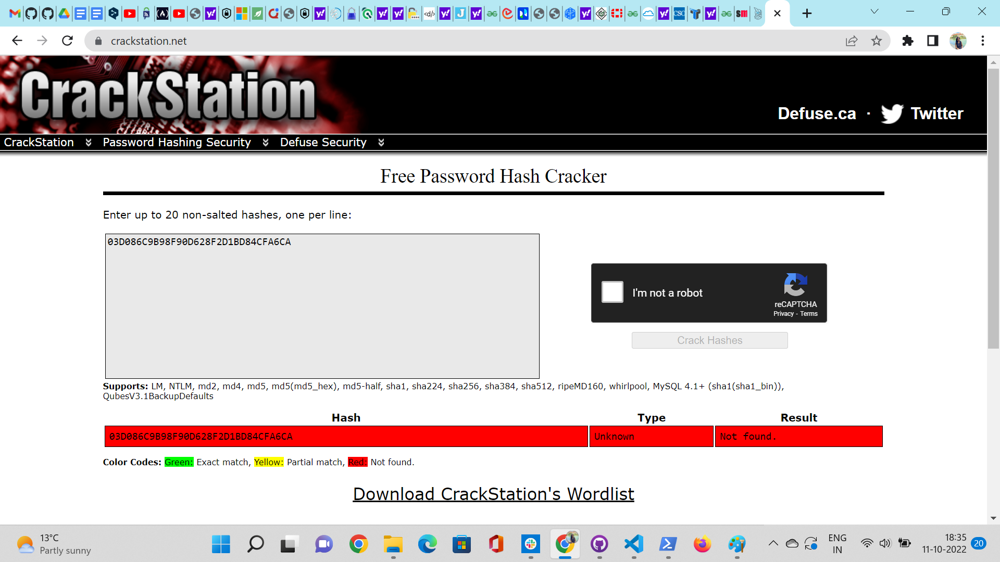
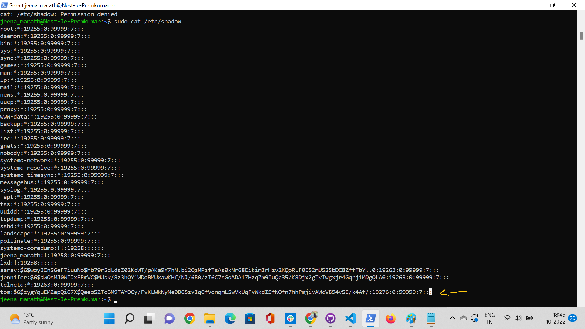
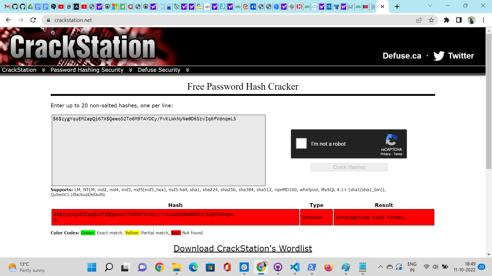
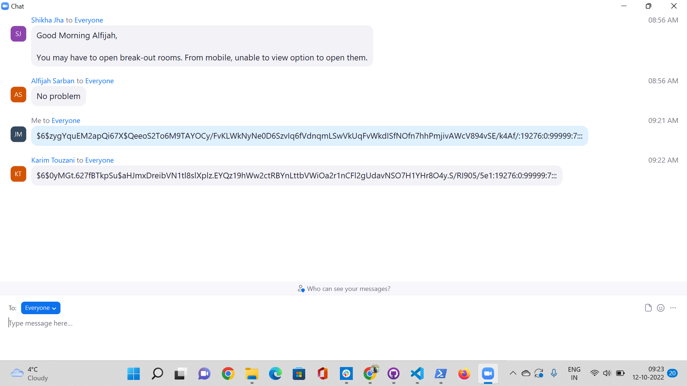

# Passwords
Passwords fall into the ‘something you know’ category.A Password is a word, phrase, or string of characters intended to differentiate an authorized user or process (for the purpose of permitting access) from an unauthorized user, or put another way a password is used to prove one’s identity, or authorize access to a resource. It’s strongly implied that a password is secret. A password is usually paired with a username or other mechanism to provide authentication.

## Key Terminologies
* Hashing : Hashing is a technique or process of mapping keys, and values into the hash table by using a hash function. 

* Message Digest (MD): MD5 was most popular and widely used hash function for quite some years..

* Secure Hash Function (SHA): SHA-3 is the most latest standard used for hashing.

* Salted Hashing- Salted password hashing can be used to improve password security by adding additional layers of randomness on top of the hashing process. Salt is a cryptographically secure random string that is added to a password before it’s hashed, and the salt should be stored with the hash, making it difficult for an attacker to know the original plaintext without having access to both sources. This process is often used in combination with bcrypt, another function that adds computing requirements for each and every attempt by an attacker who doesn’t have access to either source. Salted hashing is a much more complex and secure process because each hash requires the use of a different and random ‘salt’, that acts as an additional layer of encryption. This means that every known salt (or collection) is required to perform the password hashing function..

## Exercise 

- Find out what hashing is and why it is preferred over symmetric encryption for storing passwords.
- Find out how a Rainbow Table can be used to crack hashed passwords.
- Below are two MD5 password hashes. One is a weak password, the other is a string of 16 randomly generated characters. Try to look up both hashes in a Rainbow Table.
03F6D7D1D9AAE7160C05F71CE485AD31
03D086C9B98F90D628F2D1BD84CFA6CA
- Create a new user in Linux with the password 12345. Look up the hash in a Rainbow Table.
- Despite the bad password, and the fact that Linux uses common hashing algorithms, you won’t get a match in the Rainbow Table. This is because the password is salted. To understand how salting works, find a peer who has the same password in /etc/shadow, and compare hashes.

### Sources

* [Hashing](https://heimdalsecurity.com/blog/what-is-hashing/)
* [Hashing password ](https://www.csoonline.com/article/3602698/hashing-explained-why-its-your-best-bet-to-protect-stored-passwords.html#:~:text=Hashing%20is%20a%20cryptographic%20process%20that%20can%20be,validate%20files%2C%20documents%20and%20other%20types%20of%20data.)
* [Password hashing](https://www.darkreading.com/risk/safely-storing-user-passwords-hashing-vs-encrypting)
* [Rainbow Table](https://www.geeksforgeeks.org/understanding-rainbow-table-attack/#:~:text=A%20rainbow%20table%20is%20a%20database%20that%20is,out%20what%20plaintext%20password%20produces%20a%20particular%20hash.)
* [Rainbow table explained](https://sugermint.com/rainbow-tables-for-cracking-passwords/)
* [linux password storage](https://linuxhint.com/where_and_how_are_passwords_stored_on_linux/)
* [Salted Hashing](https://www.geeksforgeeks.org/what-is-salted-password-hashing/#:~:text=Salt%20is%20a%20cryptographically%20secure%20random%20string%20that,original%20plaintext%20without%20having%20access%20to%20both%20sources.)
* [Salt](https://auth0.com/blog/adding-salt-to-hashing-a-better-way-to-store-passwords/)
* [ Salt explained ](https://auth0.com/blog/adding-salt-to-hashing-a-better-way-to-store-passwords/)
* [Hash functions](https://www.tutorialspoint.com/cryptography/cryptography_hash_functions.htm)

### Overcome challenges
 

 ### Results

 #### Question 1

Hashing is the process of translating a given key into a code. A hash function is used to substitute the information with a newly generated hash code.
Hashes are the result of a mathematical function that converts a text string (no matter the length) into an encrypted string of a fixed length. For every given piece of data input, algorithms such as MD5 (Message Digest 5) or SHA (Secure Hash Algorithm) fundamentally generate a unique, fixed-length string – the hash value.
Hashing is basically a one-way cryptographic function. Because hashes are irreversible, knowing the output of a hashing method does not allow you to recreate the contents of a file.

Hashing is almost always preferable to encryption when storing passwords inside databases because in the event of a compromise attackers won't get access to the plaintext passwords and there's no reason for the website to ever know the user's plaintext password. 
symmetric encryption is a reversible operation. This means that the encryption key must be accessible to the application and will be used for every password verification.
If the encrypted passwords are stolen, the attackers only need to determine the symmetric key used by the application. Once that key becomes known, through a breach or through brute force attacks on a weak key, all passwords are instantly decrypted and accessible. 

 #### Question 2

 Rainbow Tables
 A rainbow table is a database that is used to gain authentication by cracking the password hash. It is a precomputed dictionary of plaintext passwords and their corresponding hash values that can be used to find out what plaintext password produces a particular hash.

 *How does the Rainbow Table Attack work?*

 A rainbow table works by doing a cryptanalysis very quickly and effectively.There are two main steps in this: 

 Creating a Table : Here, the hash of a string is taken and then reduced to create a new string, which is reduced again, repeatedly.
 For example, let’s create a table of the most common password, 12345678, using MD5 hash function on first 8 characters: 

1. First we take the string and pass it through md5 hash function. 

    hashMD5(12345678) = 25d55ad283aa400af464c76d713c07ad

2. We reduce the hash by taking only the first 8 characters. Then, we re-hash it. 

    hashMD5(25d55ad2) = 5c41c6b3958e798662d8853ece970f70

3. This is repeated until enough hashes in output chain. This represents one chain, which starts from the first plain text and ends at the last hash.

4. After obtaining enough chains, we store them in a table.

Cracking the Password : Starting off with the hashed text (the password) its checked if it exists in the database. If so, go to the start of the chain and start hashing until there is a match. As soon as the match is obtained, the process ceases and the authentication is cracked. 

 #### Question 3

 The first hashcode  of a weaker password was found in the database easily and got an exact match.

 

The second hashcode which was generated using random generated characters was a stronger password and wasnt present in the rainbow table.

 
 #### Question 4 

 A user was created in the Linux and given password 12345. The user and password details was present in /etc/passwd file. The hashcode for the password is present in the /etc/shadow file. I tried using the rainbow table to crack this hashcode but it showed unrecognisable format.

 /etc/shadow is show below:

 

The hashcode for the same password 12345 is different for my peer and me as can be seen from the below screenshot

