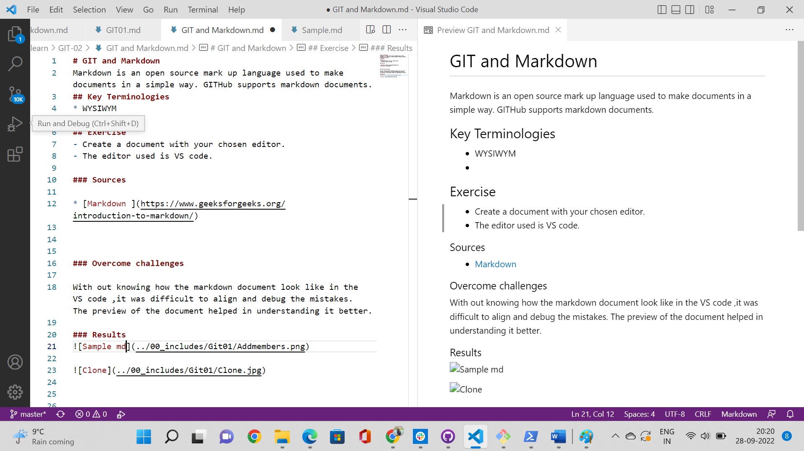

# GIT and Markdown
Markdown is an open source mark up language used to make documents in a simple way. GITHub supports markdown documents.
## Key Terminologies
* WYSIWYM
*
## Exercise
- Create a document with your chosen editor.
- The editor used is VS code.

### Sources

* [Markdown ](https://www.geeksforgeeks.org/introduction-to-markdown/)

### Overcome challenges
 
With out knowing how the markdown document look like in the VS code ,it was difficult to align and debug the mistakes. The preview of the document helped in understanding it better.

### Results
VS code sample

