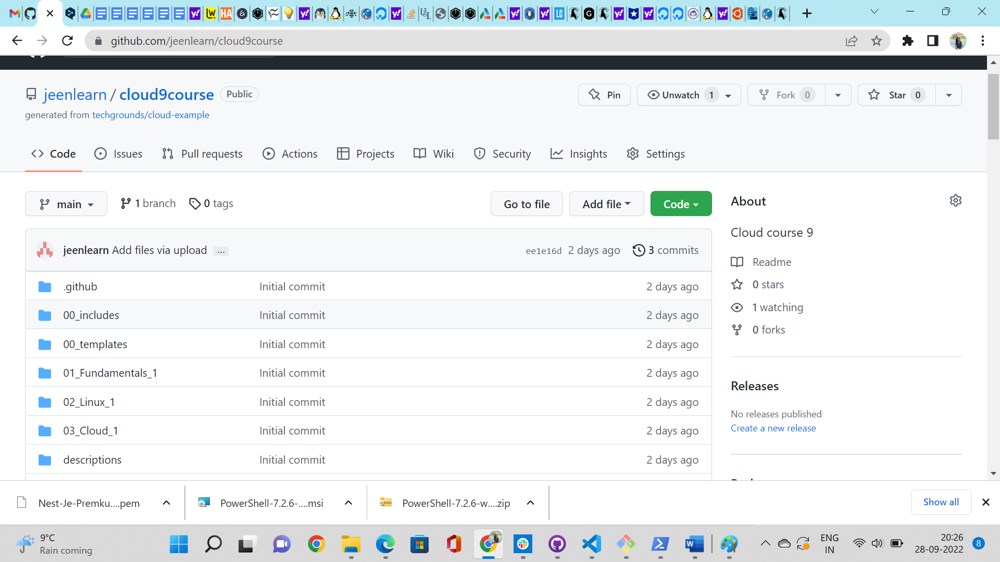
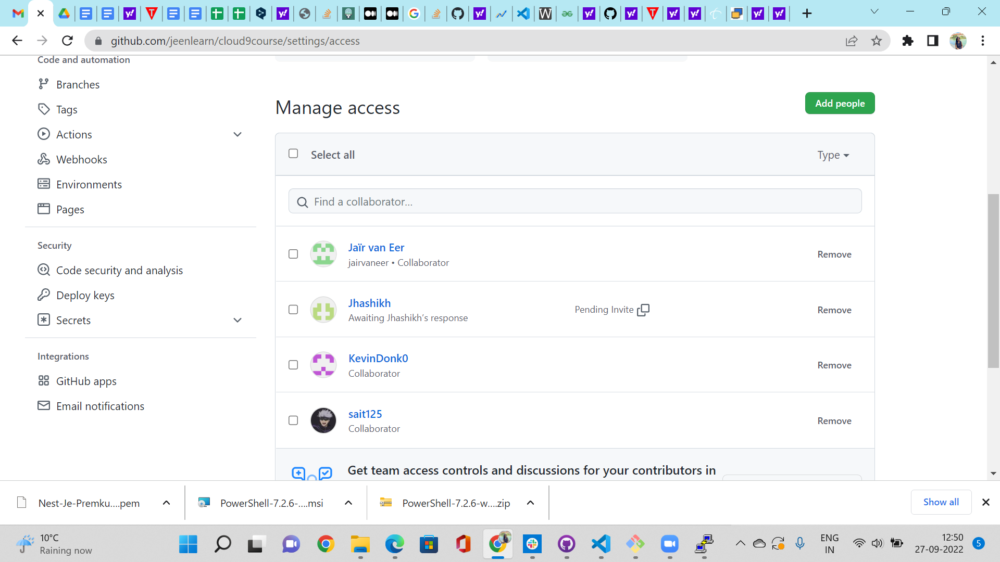
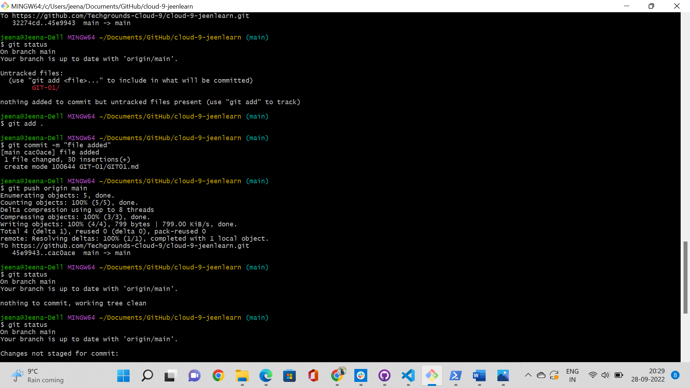
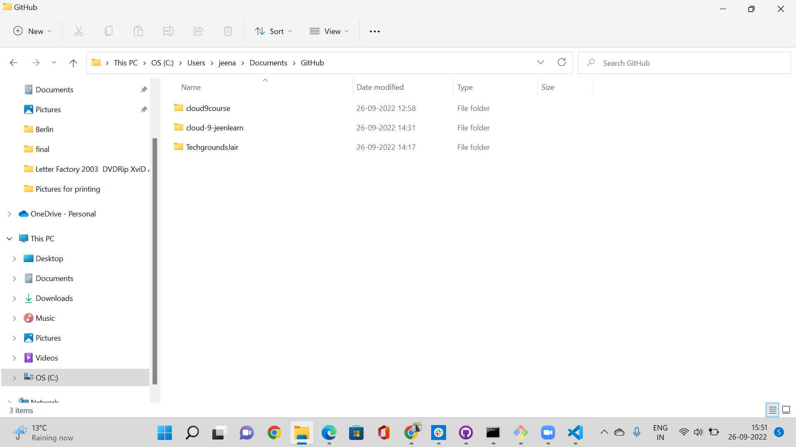

# GIT Hub
The git hub respository is a remote repository 
## Key Terminologies
* Repository
* Master/Branch
* Commit
* Push/pull 
* Clone
## Exercise
- Create a GitHub account if you don't already have one
- Create a repository on your GitHub account for your portfolio
- Give permissions to your teammates to use the repository
- Push your code to your repository
- Pull / Clone a repository from your peer.

### Sources

* [link1](https://blog.devgenius.io/how-to-push-your-code-to-github-using-few-git-commands-69171c185bf1)

* [link2](https://medium.com/@saivishwanath18/how-to-push-code-into-github-8e20f993b9d2)

### Overcome challenges
 The intial challenge was to get an understanding of  how the GIT works. After reading some content on it , was able to understand it better.

### Results

Git Repository

Giving access to members

Pushing Code

Cloning a members git repository

