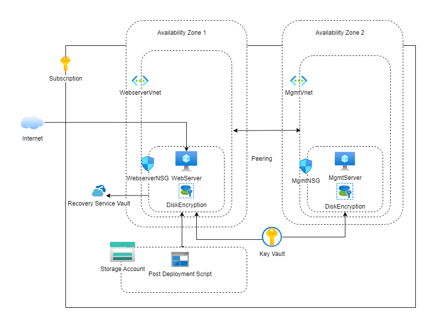
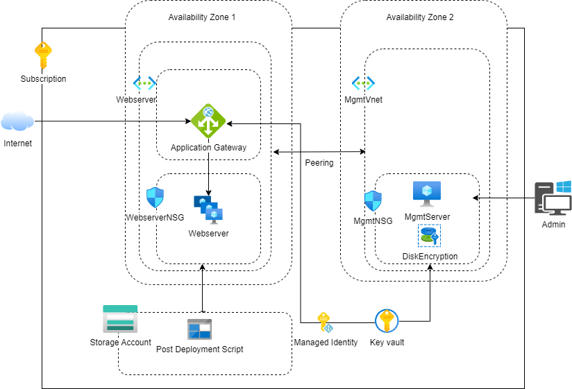

# Design Project V1.0

The Project V1.0 Infrastructure as Code delivers the client the application code to move the infrastructure from the on-premises to cloud.
The project is implemented in different modules and each module deploys some resources and all these modules are called in one main module which deploys the whole project with some parameters which the client has to input before deploying the code.

## Main module:

The main module calls all the different modules. The main module target scope is set to Subscription. In this module the resource group resource is first created and this is made as the scope for the rest of the resources which are created in each module. The location chosen for the creation of resources is Eastus.

### Storage module:
The resources used in this module are storageAccount and deploymentScripts.
The output of the module is the storage account name.

* Microsoft.Storage/storageAccount

The storage account resource is created along with the container named ‘data’ and blob named ‘installapache.sh’. The storage account name should be a unique name.

* Microsoft.Resources/deploymentScripts

The deploymentScripts resource is used for uploading the post deployment script file. Here the installapache.sh is the file which will be uploaded to the storage account from the local machine and this script will be used as the user data while deploying the webserver virtual machine. 

### Management Server module:

The resources used in this module are publicIPAddress, virtualNetworks, networkSecurityGroups, networkInterfaces, virtualMachines and the existing storageAccount.
The inputs to this module are adminusername, adminuserpassword and publicdnsname which are provided at the beginning of deployment.
The output of this module is the name of the management server which is needed for other modules.

* Microsoft.Network/publicIPAddress

The management server needs a public ip address to be accessed. This resource creates a Static public Ip address. 

* Microsoft.Network/virtualNetworks

The management server has to be placed in its own virtual network and subnet. This resource creates that virtual network and the subnet uses the CIDR block 10.20.20.0/24. 

* Microsoft.Network/networkSecurityGroups

The management server should be available to the set of users through the SSH /RDP. These ports are open for the set IP addresses
. 
* Microsoft.Network/networkInterfaces

This resource specifies the private and public ip address of the management server.

* Microsoft.Compute/virtualMachine

The management server is this resource. The virtual machine that we are choosing to use is a Windows server with the version 2022-datacenter-azure-edition-core and virtual machine size of Standard_B2ms, which is not the cheapest, but as the requirement mentions to encrypt the disks of the virtual machine, the disk size should be minimum 8gb.

*  Microsoft.Storage/storageAccount

The existing storage account is used for the boot strap diagnostics logs.

### Web Server module:

This module will create a web server and will be accessible to the public with the public ip or the public dns name. 
The resources used in this module are publicIPAddress, virtualNetworks, networkSecurityGroups, networkInterfaces, virtualMachines and virtualMachine/extensions.
The inputs to this module are adminusername, adminuserpassword and publicdnsname which are provided at the beginning of deployment.
The output of this module is the name of the web server and virtual network name which is needed for other modules.

*  Microsoft.Network/publicIPAddresses

The web server needs a public ip address to be accessed. This resource creates a Static public Ip address.  

*  Microsoft.Network/virtualNetworks

The web server has to be placed in its own virtual network and subnet. This resource creates that virtual network and the subnet uses the CIDR block 10.10.10.0/24.

*  Microsoft.Network/networkSecurityGroups

The web server should be available to the management server users through SSH ie port 22. The port 80 and 443 is open for the public and the website should be available to public. 

*  Microsoft.Network/networkInterfaces

This resource specifies the private and public ip address of the web server.

* Microsoft.Compute/virtualMachine

The virtual machine that we are choosing to use is a Ubuntu server with the version 18.04-LTS and virtual machine size of Standard_B2ms, which is not the cheapest, but as the requirement mentions to encrypt the disks of the virtual machine, the disk size should be minimum 8gb. This resource is the web server vm.

* Microsoft.Compute/virtualMachine/extensions

This resource is used to run the post deployment script that we uploaded in the Storage. This will take the script from the Storage account and will execute the script. This script execution will make the virtual machine the Apache webserver.

### Virtual Network Peering module:

This module is used to peer the two virtual networks which was created for placing the 2 virtual machines. The peering connects from both sides.
The resource used for this is Microsoft.Network/virtualNetworks/virtualNetworkPeerings

### Backup module:

This module is used to back up the webserver. 

The resources used for this is Microsoft.RecoveryServices/vaults , a backup policy for scheduling the back up is done using the Microsoft.RecoveryServices/vaults/backupPolicies,  and in the Microsoft.RecoveryServices/vaults/backupFabrics/protectionContainers/protectedItems resource we are passing the virtual machine to be backed up.

### Key vault module:

This module creates a key vault for your project. The key vault is used for storing the encryption keys for encrypting the disks of the virtual machines.
The resources used in this module is Microsoft.KeyVault/vaults.

### Disk Encryption module:

This module is used to encrypt the OS and data disks( if present)  in both the virtual machines. The Azure Disk encryption flag will be enabled after the encryption . Depending on the size of the disk the encryption might take some minutes to few hours, during this time the web server wont be available to access.

The resource used for azure disk encryption is Microsoft.Compute/virtualMachines/extensions. 

# Design Project V1.1

In the V1.1 , the web server is changed from a virtual machine to virtual machine scale set to accomodate the scalabitity. When the web server is accessed by more users it should be able to serve all the users with out interruption. For this requirement we moved our web server to Virtual machine scale set which has the auto scaling ability. To make the web server more secure we need to inject a ssl certificate on the web server. In this design I have used the a Key Vault to generate a self signed certificate and this can be changed in future with a real certificate. For creating a certificate Im using a deployment script and it needs a Managed Identity to do the operation. So a managed identity is created and passed to the deployment script.The managed identity is used in the application gateway to get the secret url id from the key vault, so need to referenced inthe application gateway. The application gateway is configured to listen to both http and https and whenever ever a http request comes it gets redirected to https.

The modules which were used same as V1.0 in the V1.1 are Management Server, Storage Account, Virtual Netwowk Peering and Disk Encryption of the management server.

The resources that are used for achieving this requirement are :

* Microsoft.Compute/virtualMachineScaleSets 

* Microsoft.Insights/autoscalesettings

The other resources which are used in the Webserver are:

* Microsoft.Network/networkSecurityGroups - The ports 443 and 80 are open for public. The port 22 is open to the management server.

* Microsoft.Network/virtualNetworks 

* Microsoft.Network/publicIPAddresses

* Microsoft.Network/applicationGateways - The Application Gateway is used for load balancing and this will be used for the SSL offloading also.

* Microsoft.ManagedIdentity/userAssignedIdentities - Since we are using Key Vault to manage the self signed certificate we need to have a Managed Identity to access the ssl certificate from it in the Application Gateway. 

* Microsoft.KeyVault/vaults - This is used for the storing the ssl certificate and the certificate is accessed using the secretId.

* Microsoft.Resources/deploymentScripts - The Deployment script is used to create a self signed certificate in the key vault and it outputs the secretID url .

* Microsoft.Compute/virtualMachines/extensions - This extension is used for disk encryption of the management server. 

